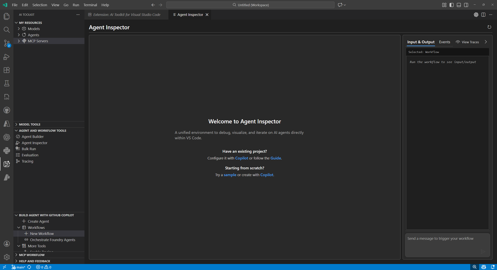

# Agent Inspector

The Agent Inspector enables developers to debug, visualize, and iterate on AI agents directly within VS Code. Press F5 to launch your agent with full debugger support, view real-time streaming responses, and visualize multi-agent workflow execution.


## Benefits

| Benefit | Description |
|---------|-------------|
| **One-click F5 debugging** | Launch your agent with breakpoints, variable inspection, and step-through debugging. |
| **Auto-configured by Copilot** | GitHub Copilot generates agent code and configures debugging, endpoints, and environment. |
| **Production-ready code** | Generated code uses Hosted Agent SDK, ready to deploy to Microsoft Foundry. |
| **Real-time visualization** | View streaming responses, tool calls, and workflow graphs between agents. |
| **Quick code navigation** | Double-click workflow nodes to jump to corresponding code. |

## Prerequisites

- **Agent Framework SDK**: Agent built using `agent-framework` SDK
- **Python 3.10+** and **VS Code AI Toolkit** extension

## Quick start


### Option 1: Scaffold a sample (Recommended)

1. Select **AI Toolkit** in the Activity Bar → **Agent and Workflow Tools** → **Agent Inspector**
2. Select **Scaffold a Sample** to generate a pre-configured project
3. Follow the README to run and debug the sample agent

### Option 2: Use Copilot to create anew agent

1. Select **AI Toolkit** in the Activity Bar → **Agent and Workflow Tools** → **Agent Inspector**
2. Select **Build with Copilot** and provide agent requirements
3. Copilot generates agent code and configures debugging automatically
4. Follow the instructions from Copilot output to run and debug your agent

### Option 3: Start with an existing agent

If you already have an existing AI agent built with Microsoft Agent Framework SDK, you can ask GitHub Copilot to help you configure the debugging setup for the Agent Inspector.

1. Select **AIAgentExpert** from Agent Mode.
2. Enter prompt:
   ```
   Help me set up the debug environment for the workflow agent to use AI Toolkit Agent Inspector
   ```
3. Copilot will generate the necessary configuration files and instructions to run and debug your agent using the Agent Inspector.

## Configure debugging manually

Add these files to your `.vscode` folder to set up debugging for your agent and replace `${file}` with your agent's entrypoint python file path.

<details>
<summary><b>tasks.json</b></summary>

```json
{
  "version": "2.0.0",
  "tasks": [
    {
      "label": "Validate prerequisites",
      "type": "aitk",
      "command": "debug-check-prerequisites",
      "args": { "portOccupancy": [5679, 8087] }
    },
    {
      "label": "Run Agent Server",
      "type": "shell",
      "command": "${command:python.interpreterPath} -m debugpy --listen 127.0.0.1:5679 -m agentdev run ${file} --port 8087",
      "isBackground": true,
      "dependsOn": ["Validate prerequisites"],
      "problemMatcher": {
        "pattern": [{"regexp": "^.*$", "file": 0, "location": 1, "message": 2}],
        "background": { "activeOnStart": true, "beginsPattern": ".*", "endsPattern": "Application startup complete|running on" }
      }
    },
    {
      "label": "Open Inspector",
      "type": "shell",
      "command": "echo '${input:openTestTool}'",
      "presentation": {"reveal": "never"},
      "dependsOn": ["Run Agent Server"]
    },
    { "label": "Terminate All", "command": "echo ${input:terminate}", "type": "shell", "problemMatcher": [] }
  ],
  "inputs": [
    { "id": "openTestTool", "type": "command", "command": "ai-mlstudio.openTestTool", "args": {"port": 8087} },
    { "id": "terminate", "type": "command", "command": "workbench.action.tasks.terminate", "args": "terminateAll" }
  ]
}
```
</details>

<details>
<summary><b>launch.json</b></summary>

```json
{
  "version": "0.2.0",
  "configurations": [{
    "name": "Debug Agent",
    "type": "debugpy",
    "request": "attach",
    "connect": { "host": "localhost", "port": 5679 },
    "preLaunchTask": "Open Inspector",
    "postDebugTask": "Terminate All"
  }]
}
```
</details>

## Using the Inspector

### Chat playground
Send messages to trigger the workflow and view executions in real-time.


### Workflow visualization
For `WorkflowAgent`, view the execution graph with message flows between agents. You can also:
1. Click on each node to review agent inputs and outputs. 
2. Double-click any node to navigate to the code.
3. Set breakpoints in the code to pause execution and inspect variables.


## Troubleshooting

| Issue | Solution |
|-------|----------|
| **API errors** | Agent Framework is evolving. Copy terminal errors to Copilot for fixes. |
| **Connection failed** | Verify server is running on expected port (default: 8087). |
| **Breakpoints not hit** | Ensure `debugpy` is installed and ports match in launch.json. |

## How it works

When you press F5, the Inspector:

1. **Starts the agent server** — The `agentdev` CLI wraps your agent as an HTTP server on port 8087, with debugpy attached on port 5679
2. **Discovers agents** — The UI fetches available agents/workflows from `/agentdev/entities`
3. **Streams execution** — Chat inputs go to `/v1/responses`, which streams back events via SSE for real-time visualization
4. **Enables code navigation** — Double-clicking workflow nodes opens the corresponding source file in the editor

### Architecture Overview

```
┌───────────────────────────────────────────────────────────────────────────┐
│                              VS Code                                      │
│  ┌──────────────────┐  ┌─────────────────┐  ┌──────────────────────────┐  │
│  │  Inspector UI    │  │ Python Debugger │  │    VS Code Editor        │  │
│  │   (Webview)      │  │  (debugpy)      │  │                          │  │
│  └────────┬─────────┘  └────────┬────────┘  └──────────▲───────────────┘  │
└───────────┼─────────────────────┼──────────────────────┼──────────────────┘
            │                     │                      │
            │ HTTP/WS             │ :5679                │ Open file
            │ :8087               │ (debug)              │
            │                     │                      │
┌───────────▼─────────────────────▼──────────────────────┼─────────────────────┐
│                   Local Agent Server (localhost:8087)  │                     │
│  ┌─────────────────────────────────────────────────────┼──────────────────┐  │
│  │              TestToolServer                         │                  │  │
│  │  ┌────────────────────────────────────────────────┐ │                  │  │
│  │  │  Endpoints:                                    │ │                  │  │
│  │  │  • /agentdev/entities          (list agents)   │ │                  │  │
│  │  │  • /agentdev/entities/{id}/info (get details)  │ │                  │  │
│  │  │  • /agentdev/.../location      (code nav)  ────┼─┼──────────────────┘  │
│  │  │  • /agentdev/ws/health         (WebSocket)     │ │                     │
│  │  │  • /v1/responses               (SSE stream)    │ │                     │
│  │  └────────────────┬───────────────────────────────┘ │                     │
│  │                   │                                 │                     │
│  │  ┌────────────────▼───────────────────────────────┐ │                     │
│  │  │           EventMapper                          │ │                     │
│  │  │  Agent Framework Events → OpenAI SSE Format    │ │                     │
│  │  └──────────────┬─────────────────────────────────┘ │                     │
│  └─────────────────┼───────────────────────────────────┘                     │
└────────────────────┼─────────────────────────────────────────────────────────┘
                     │
                     │ run_stream()
                     │
         ┌───────────▼────────────┐
         │   Your Agent/Workflow  │
         │  (Agent Framework SDK) │
         └────────────────────────┘
```