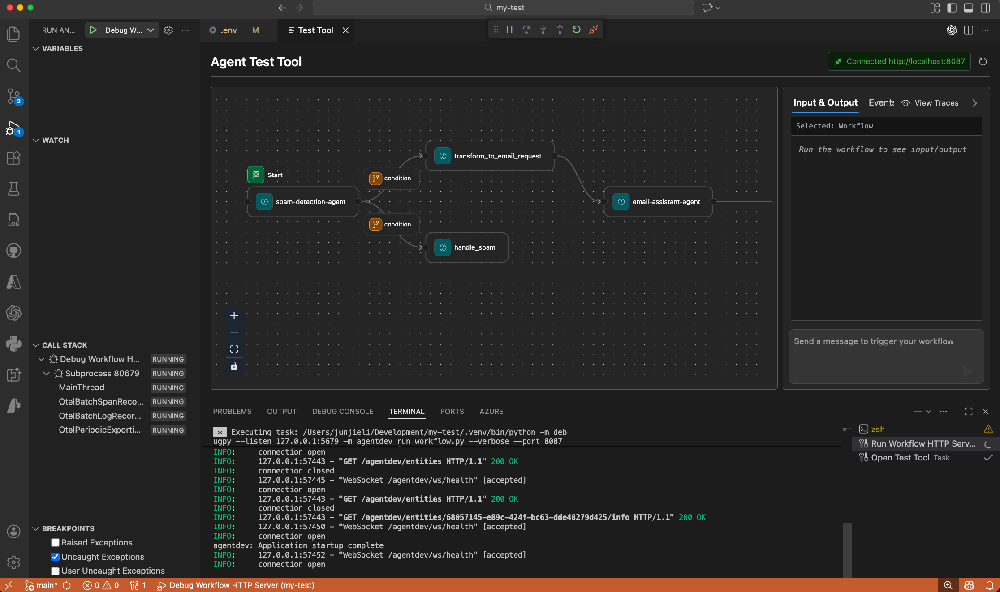
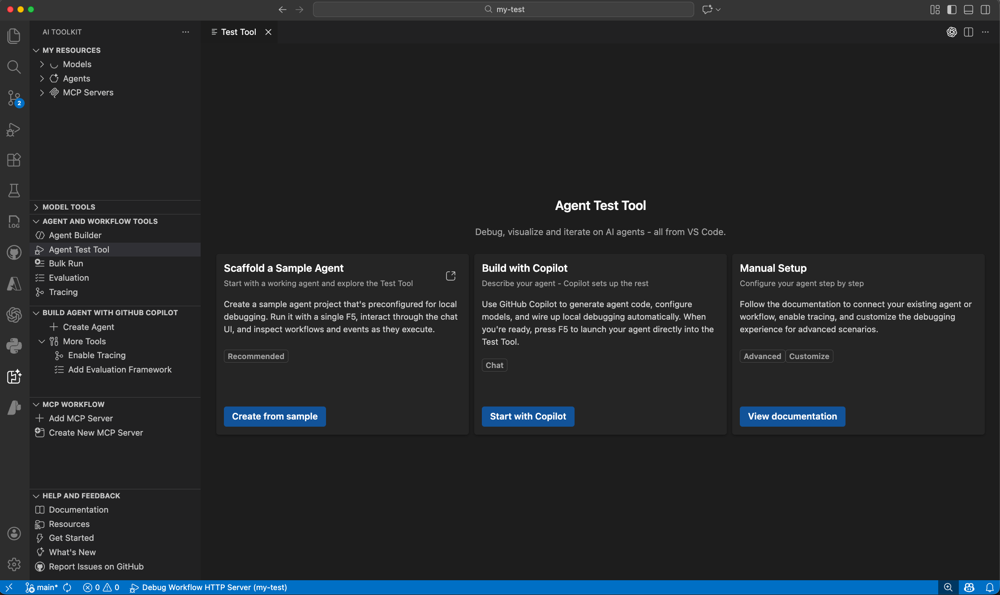
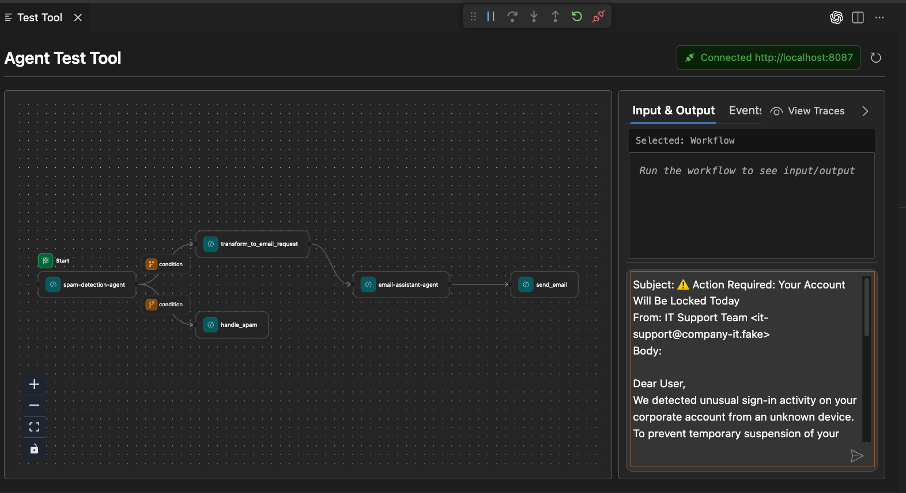
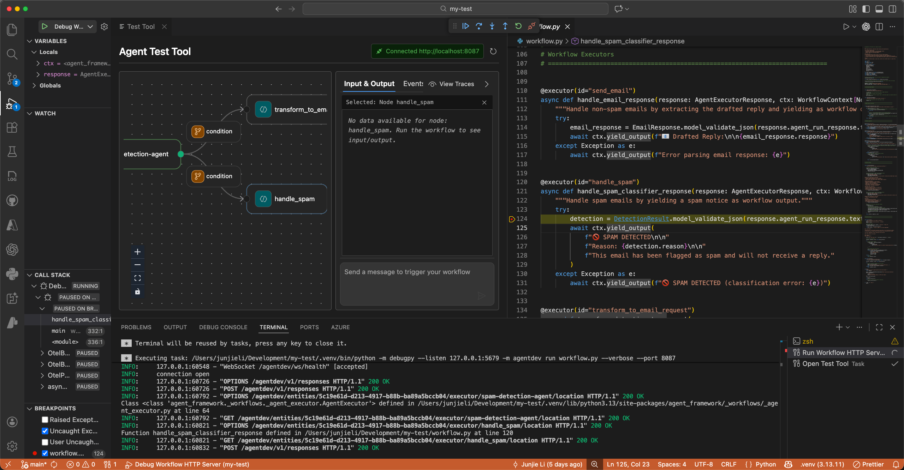

# Agent Test Tool

The Agent Test Tool enables developers to debug, visualize, and iterate on AI agents directly within VS Code. Press F5 to launch your agent with full debugger support, view real-time streaming responses, and visualize multi-agent workflow execution.



## Benefits

| Benefit | Description |
|---------|-------------|
| **One-click F5 debugging** | Launch your agent with breakpoints, variable inspection, and step-through debugging. |
| **Auto-configured by Copilot** | GitHub Copilot generates agent code and configures debugging, endpoints, and environment. |
| **Production-ready code** | Generated code uses Hosted Agent SDK, ready to deploy to Microsoft Foundry. |
| **Real-time visualization** | View streaming responses, tool calls, and workflow graphs between agents. |
| **Quick code navigation** | Double-click workflow nodes to jump to corresponding code. |

## Prerequisites

- **Agent Framework SDK**: Agent built using `agent-framework` SDK
- **HTTP Server Mode**: Serverized using `azure.ai.agentserver.agentframework`
- **Python 3.10+** and **VS Code AI Toolkit** extension

## Quick start


### Option 1: Scaffold a sample (Recommended)

1. Select **AI Toolkit** in the Activity Bar → **Agent and Workflow Tools** → **Agent Test Tool**
2. Select **Scaffold a Sample** to generate a pre-configured project
3. Follow the README to run and debug the sample agent

### Option 2: Use Copilot to create anew agent

1. Select **AI Toolkit** in the Activity Bar → **Agent and Workflow Tools** → **Agent Test Tool**
2. Select **Build with Copilot** and provide agent requirements
3. Copilot generates agent code and configures debugging automatically
4. Follow the instructions from Copilot output to run and debug your agent

### Option 3: Start with an existing agent

If you already have an existing AI agent built with Microsoft Agent Framework SDK, you can ask GitHub Copilot to help you configure the debugging setup for the Agent Test Tool.

1. Select **AIAgentExpert** from Agent Mode.
2. Enter prompt:
   ```
   Help me set up the debug environment for the workflow agent to use AI Toolkit Agent Test Tool
   ```
3. Copilot will generate the necessary configuration files and instructions to run and debug your agent using the Agent Test Tool.

## Configure debugging manually

Add these files to your `.vscode` folder to set up debugging for your agent and replace `${file}` with your agent's entrypoint python file path.

<details>
<summary><b>tasks.json</b></summary>

```json
{
  "version": "2.0.0",
  "tasks": [
    {
      "label": "Validate prerequisites",
      "type": "aitk",
      "command": "debug-check-prerequisites",
      "args": { "portOccupancy": [5679, 8087] }
    },
    {
      "label": "Run Agent Server",
      "type": "shell",
      "command": "${command:python.interpreterPath} -m debugpy --listen 127.0.0.1:5679 -m agentdev run ${file} --port 8087",
      "isBackground": true,
      "dependsOn": ["Validate prerequisites"],
      "problemMatcher": {
        "pattern": [{"regexp": "^.*$", "file": 0, "location": 1, "message": 2}],
        "background": { "activeOnStart": true, "beginsPattern": ".*", "endsPattern": "Application startup complete|running on" }
      }
    },
    {
      "label": "Open Test Tool",
      "type": "shell",
      "command": "echo '${input:openTestTool}'",
      "presentation": {"reveal": "never"},
      "dependsOn": ["Run Agent Server"]
    },
    { "label": "Terminate All", "command": "echo ${input:terminate}", "type": "shell", "problemMatcher": [] }
  ],
  "inputs": [
    { "id": "openTestTool", "type": "command", "command": "ai-mlstudio.openTestTool", "args": {"port": 8087} },
    { "id": "terminate", "type": "command", "command": "workbench.action.tasks.terminate", "args": "terminateAll" }
  ]
}
```
</details>

<details>
<summary><b>launch.json</b></summary>

```json
{
  "version": "0.2.0",
  "configurations": [{
    "name": "Debug Agent",
    "type": "debugpy",
    "request": "attach",
    "connect": { "host": "localhost", "port": 5679 },
    "preLaunchTask": "Open Test Tool",
    "postDebugTask": "Terminate All"
  }]
}
```
</details>

## Using the Test Tool

### Chat playground
Send messages to trigger the workflow and view executions in real-time.


### Workflow visualization
For `WorkflowAgent`, view the execution graph with message flows between agents. You can also:
1. Click on each node to review agent inputs and outputs. 
2. Double-click any node to navigate to the code.
3. Set breakpoints in the code to pause execution and inspect variables.


## Troubleshooting

| Issue | Solution |
|-------|----------|
| **API errors** | Agent Framework is evolving. Copy terminal errors to Copilot for fixes. |
| **Connection failed** | Verify server is running on expected port (default: 8087). |
| **Breakpoints not hit** | Ensure `debugpy` is installed and ports match in launch.json. |

## How it works

The Agent Test Tool provides an integrated debugging experience for Agent Framework-based agents and workflows through three key components:

### Architecture Overview

```
┌───────────────────────────────────────────────────────────────────────────┐
│                              VS Code                                      │
│  ┌──────────────────┐  ┌─────────────────┐  ┌──────────────────────────┐  │
│  │  Test Tool UI    │  │ Python Debugger │  │    VS Code Editor        │  │
│  │   (Webview)      │  │  (debugpy)      │  │                          │  │
│  └────────┬─────────┘  └────────┬────────┘  └──────────▲───────────────┘  │
└───────────┼─────────────────────┼──────────────────────┼──────────────────┘
            │                     │                      │
            │ HTTP/WS             │ :5679                │ Open file
            │ :8087               │ (debug)              │
            │                     │                      │
┌───────────▼─────────────────────▼──────────────────────┼─────────────────────┐
│                   Local Agent Server (localhost:8087)  │                     │
│  ┌─────────────────────────────────────────────────────┼──────────────────┐  │
│  │              TestToolServer                         │                  │  │
│  │  ┌────────────────────────────────────────────────┐ │                  │  │
│  │  │  Endpoints:                                    │ │                  │  │
│  │  │  • /agentdev/entities          (list agents)   │ │                  │  │
│  │  │  • /agentdev/entities/{id}/info (get details)  │ │                  │  │
│  │  │  • /agentdev/.../location      (code nav)  ────┼─┼──────────────────┘  │
│  │  │  • /agentdev/ws/health         (WebSocket)     │ │                     │
│  │  │  • /v1/responses               (SSE stream)    │ │                     │
│  │  └────────────────┬───────────────────────────────┘ │                     │
│  │                   │                                 │                     │
│  │  ┌────────────────▼───────────────────────────────┐ │                     │
│  │  │           EventMapper                          │ │                     │
│  │  │  Agent Framework Events → OpenAI SSE Format    │ │                     │
│  │  └──────────────┬─────────────────────────────────┘ │                     │
│  └─────────────────┼───────────────────────────────────┘                     │
└────────────────────┼─────────────────────────────────────────────────────────┘
                     │
                     │ run_stream()
                     │
         ┌───────────▼────────────┐
         │   Your Agent/Workflow  │
         │  (Agent Framework SDK) │
         └────────────────────────┘
```

**Flow:**
1. **F5 Launch** → VS Code starts agent server with debugpy attached
2. **Discovery** → UI fetches agents/workflows from `/agentdev/entities`
3. **Execution** → UI sends input to `/v1/responses`, streams back events via SSE
4. **Visualization** → EventMapper converts Agent Framework events to OpenAI format
5. **Code Nav** → Double-click node → fetch location → open file in editor
6. **Debugging** → Set breakpoints, inspect variables via debugpy connection

### 1. Local HTTP Server with Test Endpoints

The `agentdev` CLI wraps your agent as an HTTP server using `azure.ai.agentserver.agentframework`, then mounts additional test endpoints via `TestToolServer`:

- **`/agentdev/entities`** - Lists all available agents and workflows with their metadata
- **`/agentdev/entities/{id}/info`** - Returns detailed information about a specific agent or workflow
- **`/agentdev/entities/{id}/executor/{executor_id}/location`** - Provides source code location for workflow executors (enables "double-click to navigate to code")
- **`/agentdev/ws/health`** - WebSocket endpoint for connection monitoring and status updates
- **`/v1/responses`** - Streams agent/workflow execution events in OpenAI-compatible SSE format

When you run your agent with `agentdev run <file> --port 8087`, it starts this HTTP server on the specified port.

### 2. Event Mapping and Streaming

The `EventMapper` converts Agent Framework events into OpenAI-compatible streaming events that the VS Code webview can render:

- Workflow events (started, completed, failed) → workflow visualization updates
- Executor events (invoked, completed) → node activation in the workflow graph
- Agent run updates → chat messages with streaming text deltas
- Function calls → tool invocation displays with arguments and results

Events stream via Server-Sent Events (SSE) from the `/v1/responses` endpoint, enabling real-time visualization of agent execution.

### 3. VS Code Integration

The Test Tool UI opens as a webview panel when you press F5:

- **Connection management**: WebSocket connection to `/ws/health` monitors server status
- **Entity discovery**: Fetches available agents/workflows from `/agentdev/entities` 
- **Interactive testing**: Sends chat messages or workflow inputs to `/v1/responses` and renders streaming responses
- **Workflow visualization**: For `WorkflowAgent`, displays an interactive DAG with real-time execution highlighting
- **Code navigation**: Double-clicking workflow nodes calls `/agentdev/entities/{id}/executor/{executor_id}/location` to open the corresponding source file

The VS Code debugger attaches via `debugpy` on port 5679, enabling standard debugging features like breakpoints and variable inspection while the agent runs.