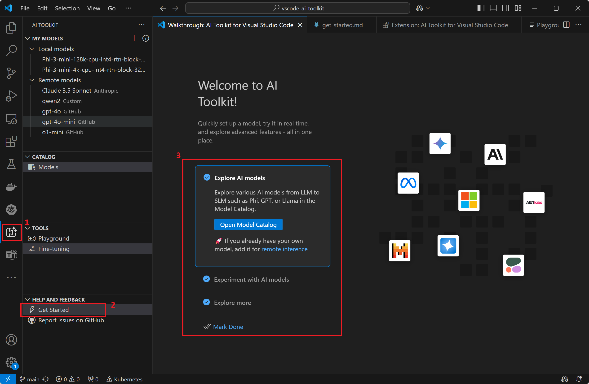

# Get Started with AI Toolkit

This document will guide you through a quick path to get started with a model in AI Toolkit that has minimal pre-requisite.

Follow [Overview](overview.md) to install and setup the AI Toolkit for Visual Studio Code.

Then follow the get started guide from AI Toolkit:

You will be in playground to test chat with an AI model quickly.
