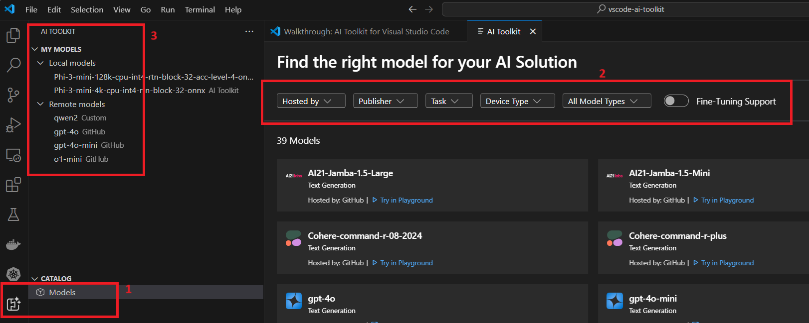

# Models in AI Toolkit

## Models supported

AI Toolkit support a boradrange of generative AI models. Both Small Language Models (SLM) and Large Language Models (LLM) are supported.

## Find a model

On AI Toolkit, click the "Models" on treeview to open the model catalog, as shown in step 1. 

There are a set of filters on model catalog as shown in step2:
- Hosted by:
    
    AI Toolkit now supports GitHub, ONNX, OpenAI, Anthropic, Google.
- Publisher:
    
    The publisher for AI models

- Task:

    Now only text generation is for this filter

- Device Type:

    Depends on the local availability, to filter models by CPU, GPU and NPU

Additional filters in "All Model Types" to filter modes that can run locally or remotely.

Fine-tuning Support switch filters only the model that can be used to run finetuning.

## License and sign-in

Some of the models require publisher or hosting service license and account to sign-in.

## Find model details

Click on each model card in model catalog to find more details on the model.

## Select a model for test

On each model card, there are several options: 
- **Try in Playground** link that can load selected model in playground for test.
- **Download** link that will download the model to local first from source like Hugging Face.
- **Load in Playground** will load the model into playground for chat.

## Bring Your Own Models

AI Toolkit's playground supports remote models. Mouse-over "MY MODELS" on treeview, a "+" sign appears to add a remote model into AI Toolkit. Fill in the requested information on model name, display name, model hosting URL and optional auth string. A remote model is added and shown in treeview as step3.

## Ollama models

User needs to install and run the Ollama runtime on local machine properly. Treat it as a "remote model". Use "http://localhost:11434/v1/chat/completions" as URL and leave auth empty. The current Ollama running model will be added as custom model. You can also see it on treeview's "MY MODEL" list. Use it the same way as other models in playground.