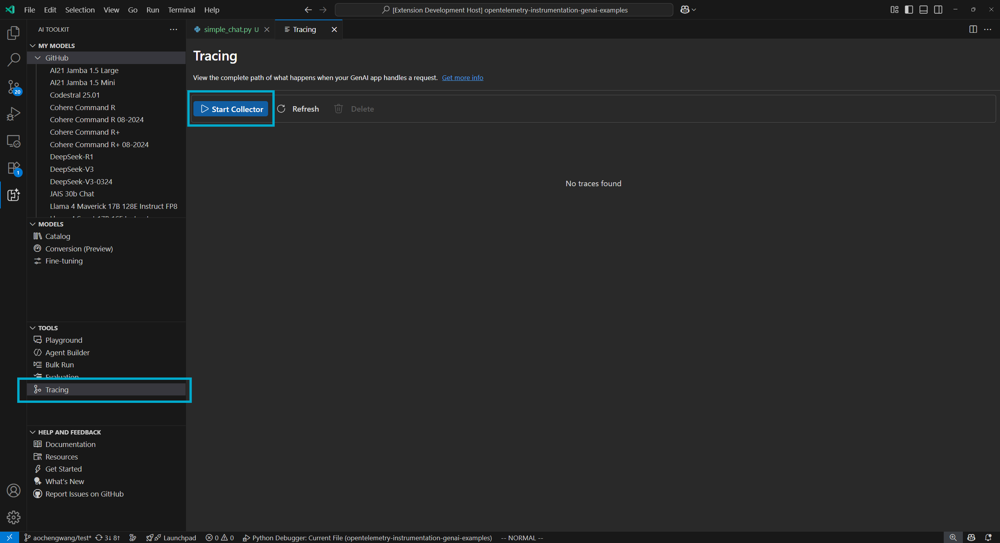
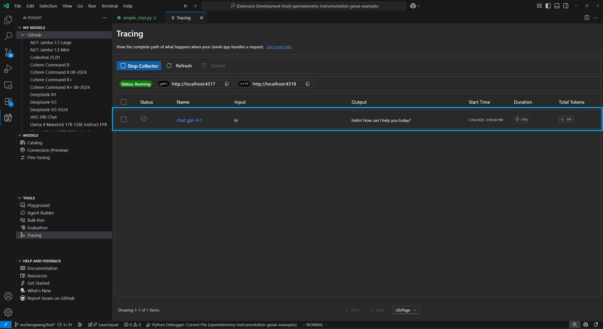
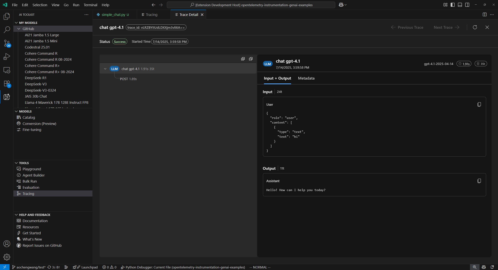

# Tracing

// TODO: opening

AI Toolkit hosts a local HTTP and gRPC server to collect trace data. The collector server is compatible with OTLP (OpenTelemetry Protocol) and most lanaguage model SDKs either directly support OTLP or have third-party instrumentation libraries to support it. After collecting the instrumentation data, AI Toolkit provides a friendly UI to visualize the data.

**Supported languages and SDKs**

| | Azure AI Inference | Azure AI Foundry Agents Service | Anthropic | Gemini | LangChain | OpenAI SDK | OpenAI Agents SDK |
|---|---|---|---|---|---|---|---|
| **Python** | ✅ | ✅ | ✅ (traceloop)<sup>2</sup> | ✅  | ✅ (langsmith) <sup>2</sup> | ✅ (opentelemetry-python-contrib) | ✅ (logfire) <sup>2</sup>  |
| **TS/JS** | ✅ | ✅ | ✅ (traceloop)<sup>2</sup>| ❌ |✅ (traceloop) <sup>2</sup> |✅ (traceloop) <sup>2</sup>|❌|

> 1. Since their official SDKs don't support OpenTelemetry instrumentation, these third-party instrumentation SDKs in the brackets are used.
> 2. These Instrument SDKs doesn't strictly adhere to the OpenTelemetry Semantic Convention.

## How to Get Started to Use Tracing

1. Select **Tracing** in tree view to open the tracing webview and click **Start Collector** button to start the local OTLP trace collector server.



2. Add code snippet to your AI app to enable instrumentation. See the [Set up instrumentation](#set-up-instrumentation) section about code snippet for different languages and SDKs.

3. Run your app to generate trace data.

4. Click **Refresh** button in the tracing webview to see new trace data.




## Set up Instrumentation

<details>
<summary>Azure AI Foundry Agent Service / Azure AI Inference SDK - Python</summary>

**Installation:**
```bash
pip install opentelemetry-sdk opentelemetry-exporter-otlp-proto-http azure-ai-inference[opentelemetry]
```

**Setup:**
```python
import os
os.environ["AZURE_TRACING_GEN_AI_CONTENT_RECORDING_ENABLED"] = "true"
os.environ["AZURE_SDK_TRACING_IMPLEMENTATION"] = "opentelemetry"

from opentelemetry.sdk.resources import Resource
from opentelemetry.sdk.trace import TracerProvider
from opentelemetry.sdk.trace.export import BatchSpanProcessor
from opentelemetry.exporter.otlp.proto.http.trace_exporter import OTLPSpanExporter

resource = Resource(attributes={
    "service.name": "opentelemetry-instrumentation-azure-ai-agents"
})
provider = TracerProvider(resource=resource)
otlp_exporter = OTLPSpanExporter(
    endpoint="http://localhost:4318/v1/traces",
)
processor = BatchSpanProcessor(otlp_exporter)
provider.add_span_processor(processor)
trace.set_tracer_provider(provider)

from azure.ai.agents.telemetry import AIAgentsInstrumentor
AIAgentsInstrumentor().instrument(True)
```
</details>

<details>
<summary>Azure AI Foundry Agent Service / Azure AI Inference SDK - TypeScript / JavaScript</summary>

**Installation:**
```bash
npm install @azure/opentelemetry-instrumentation-azure-sdk @opentelemetry/api @opentelemetry/exporter-trace-otlp-proto @opentelemetry/instrumentation @opentelemetry/resources @opentelemetry/sdk-trace-node
```

**Setup:**
```javascript
/** Set up for OpenTelemetry tracing **/
const { context } = require("@opentelemetry/api");
const { resourceFromAttributes } = require("@opentelemetry/resources");
const {
  NodeTracerProvider,
  SimpleSpanProcessor,
} = require("@opentelemetry/sdk-trace-node");
const { OTLPTraceExporter } = require('@opentelemetry/exporter-trace-otlp-proto');

const exporter = new OTLPTraceExporter({
    url: "http://localhost:4318/v1/traces",
});
const provider = new NodeTracerProvider({
    resource: resourceFromAttributes({
        "service.name": "opentelemetry-instrumentation-azure-ai-inference",
    }),
    spanProcessors: [
        new SimpleSpanProcessor(exporter)
    ],
});
provider.register();

const { registerInstrumentations } = require("@opentelemetry/instrumentation");
const { createAzureSdkInstrumentation } = require("@azure/opentelemetry-instrumentation-azure-sdk");

registerInstrumentations({
  instrumentations: [createAzureSdkInstrumentation()],
});
```
</details>

<details>
<summary>OpenAI - Python</summary>

**Installation:**
```bash
pip install opentelemetry-sdk opentelemetry-exporter-otlp-proto-http opentelemetry-instrumentation-openai-v2
```

**Setup:**
```python
from opentelemetry import trace
from opentelemetry.exporter.otlp.proto.http.trace_exporter import OTLPSpanExporter
from opentelemetry.sdk.trace import TracerProvider
from opentelemetry.sdk.trace.export import BatchSpanProcessor
from opentelemetry.instrumentation.openai_v2 import OpenAIInstrumentor

# Set up tracer provider
trace.set_tracer_provider(TracerProvider())

# Configure OTLP exporter
otlp_exporter = OTLPSpanExporter(
    endpoint="http://localhost:4318/v1/traces"
)

# Add span processor
trace.get_tracer_provider().add_span_processor(
    BatchSpanProcessor(otlp_exporter)
)

# Enable OpenAI instrumentation
OpenAIInstrumentor().instrument()
```
</details>

<details>
<summary>OpenAI - TypeScript/JavaScript</summary>

**Installation:**
```bash
npm install @traceloop/instrumentation-openai @traceloop/node-server-sdk
```

**Setup:**
```javascript
const { initialize } = require("@traceloop/node-server-sdk");
initialize({
    appName: "opentelemetry-instrumentation-openai-traceloop",
    baseUrl: "http://localhost:4318",
    disableBatch: true,
});
```
</details>

## A full example

Here's a complete working example using OpenAI with Python that demonstrates how to set up both the tracing provider and instrumentation:

### Installation
```bash
pip install opentelemetry-sdk opentelemetry-exporter-otlp-proto-http opentelemetry-instrumentation-openai-v2
```
### Python Code

```python
import os

### Set up for OpenTelemetry tracing ###
os.environ["AZURE_TRACING_GEN_AI_CONTENT_RECORDING_ENABLED"] = "true"
os.environ["AZURE_SDK_TRACING_IMPLEMENTATION"] = "opentelemetry"

from opentelemetry import trace
from opentelemetry.sdk.resources import Resource
from opentelemetry.sdk.trace import TracerProvider
from opentelemetry.sdk.trace.export import BatchSpanProcessor
from opentelemetry.exporter.otlp.proto.http.trace_exporter import OTLPSpanExporter

resource = Resource(attributes={
    "service.name": "opentelemetry-instrumentation-azure-ai-inference"
})
provider = TracerProvider(resource=resource)
otlp_exporter = OTLPSpanExporter(
    endpoint="http://localhost:4318/v1/traces",
)
processor = BatchSpanProcessor(otlp_exporter)
provider.add_span_processor(processor)
trace.set_tracer_provider(provider)

from azure.ai.inference.tracing import AIInferenceInstrumentor
AIInferenceInstrumentor().instrument()
### Set up for OpenTelemetry tracing ###

from azure.ai.inference import ChatCompletionsClient
from azure.ai.inference.models import UserMessage
from azure.ai.inference.models import TextContentItem
from azure.core.credentials import AzureKeyCredential

client = ChatCompletionsClient(
    endpoint = "https://models.inference.ai.azure.com",
    credential = AzureKeyCredential(os.environ["GITHUB_TOKEN"]),
    api_version = "2024-08-01-preview",
)

response = client.complete(
    messages = [
        UserMessage(content = [
            TextContentItem(text = "hi"),
        ]),
    ],
    model = "gpt-4.1",
    tools = [],
    response_format = "text",
    temperature = 1,
    top_p = 1,
)

print(response.choices[0].message.content)
```

After you run the code and refresh the tracing webview, you will see a new trace in the list. Click the trace to open the trace details webview.


In the trace details webview, you can check the complete execution flow of your app in the left span tree view.

After you select a span in the span tree view, the right span details view will show generative AI messages in **Input + Output** tab, if any. You can also view the raw metadata in **Metadata** tab.



