# Remote inference in Playground

Users can chat with remotely hosted language model in playground.

## Prerequisites

- AI Toolkit v0.4.0 or newer.
- OpenAI compatible chat completion endpoint.

## How to add a remote model

1. Click the "+" icon when hovering on "MODELS" tree view or enter `AI Toolkit: Add model for remote inference` in command palette.

    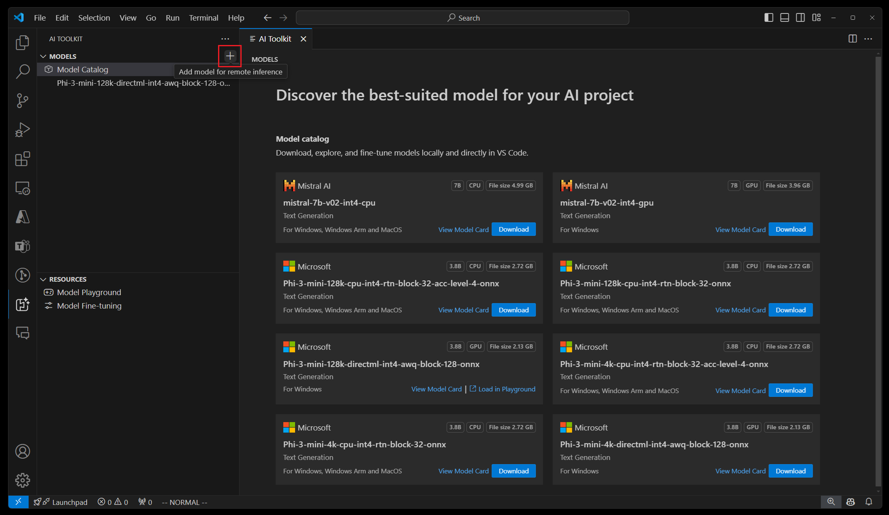

    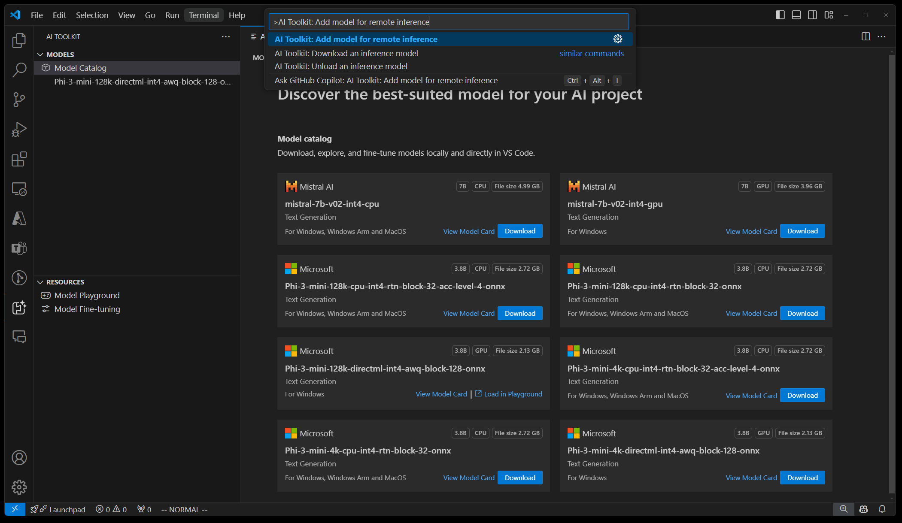

2. Enter the model name and press Enter.

    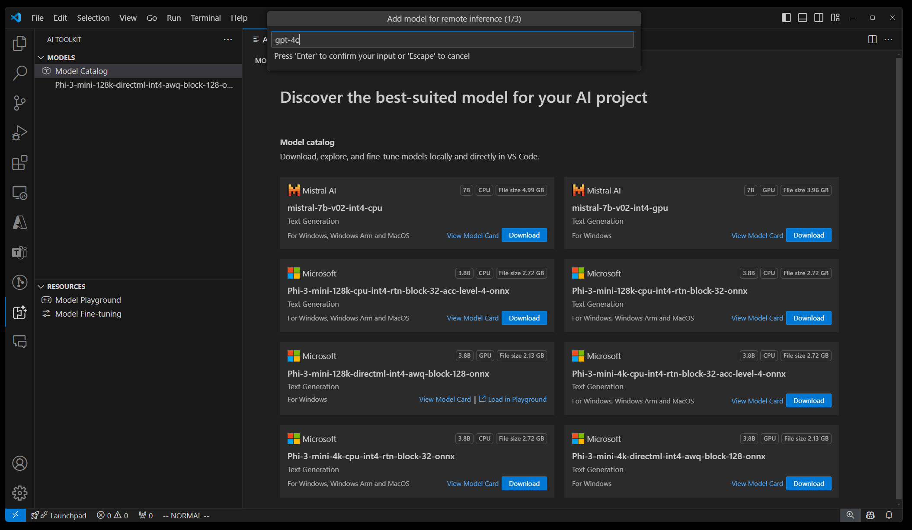

    > Note: The model name is sent to the chat completion endpoint as the ["model" parameter](https://platform.openai.com/docs/api-reference/chat/create#chat-create-model) when running inference.

3. Enter OpenAI compatible chat completion endpoint URL.

    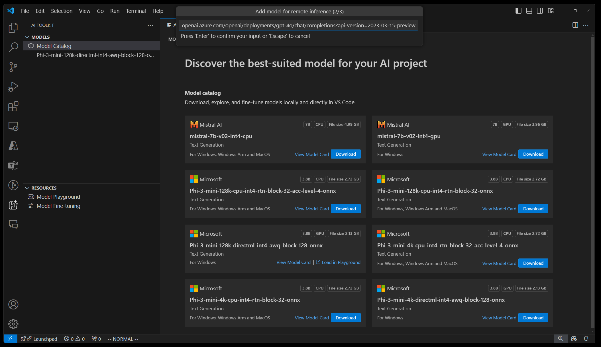

4. If your endpoint requires authentication, you can set an authentication header for API key. Otherwise, your can just press Enter to skip this step.

    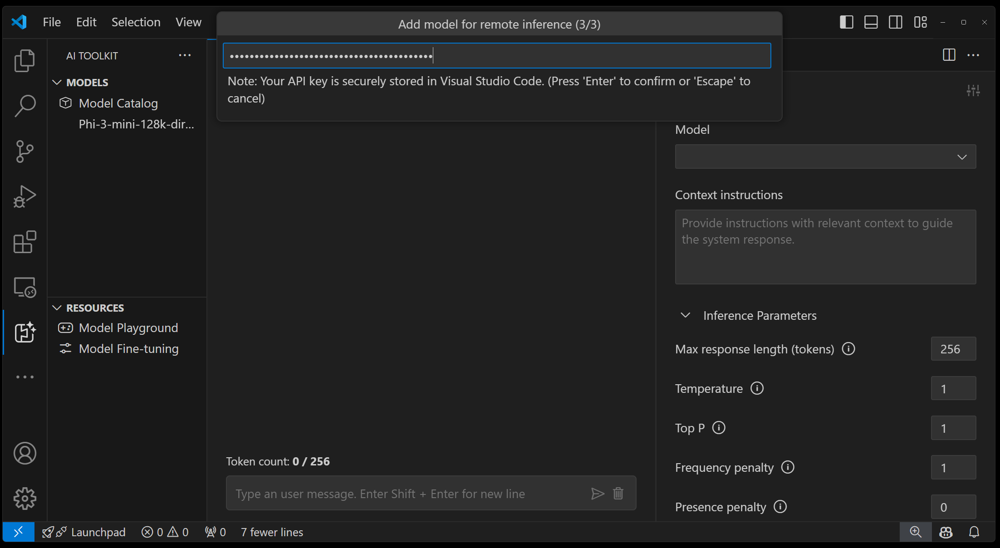

5. After it is successfully added, the new model will appear in tree view, tagged with `Remote`. It will also appear in model drop down in playground. You can select the model in playground and try inference just like other local models.

    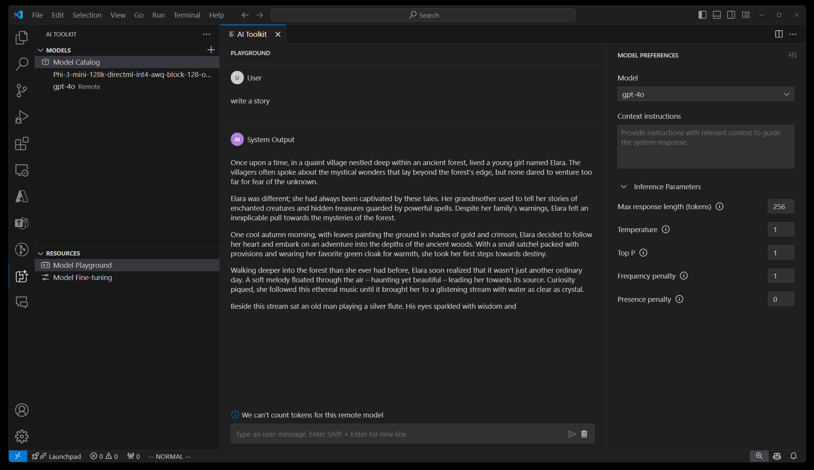

    > Note: AI Toolkit will send the chat history, context instructions and parameters to the endpoint, but it depends on the actual endpoint and model whether they are supported.

## FAQ

### How can I find my endpoint and authentication header?

Here are some examples about how to find your endpoint and authentication headers in common OpenAI service providers. For other providers, you can check out their documentation about the chat completion endpoint and authentication header.

#### Example 1: Azure OpenAI

1. Go to the `Deployments` blade in Azure OpenAI Studio and select a deployment, for example, `gpt-4o`. If you don't have a deployment yet, you can checkout [the documentation](https://learn.microsoft.com/en-us/azure/ai-services/openai/how-to/create-resource?pivots=web-portal) about how to create a deployment.

    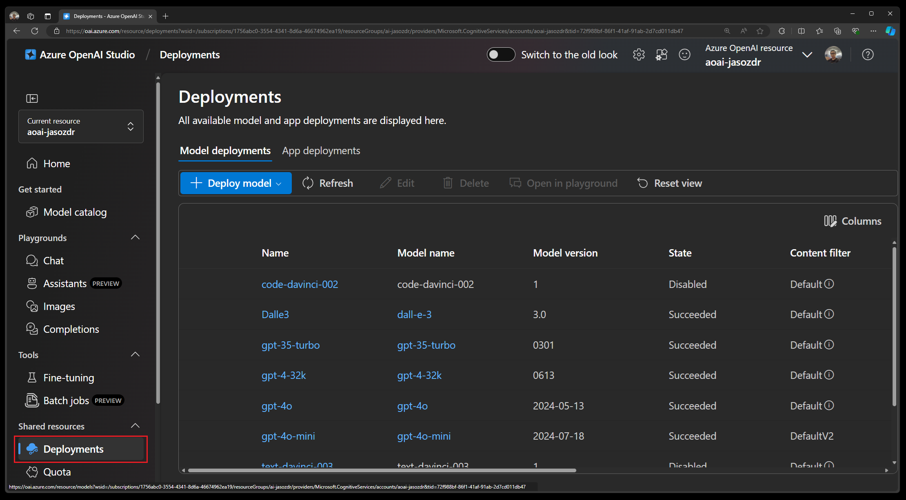

    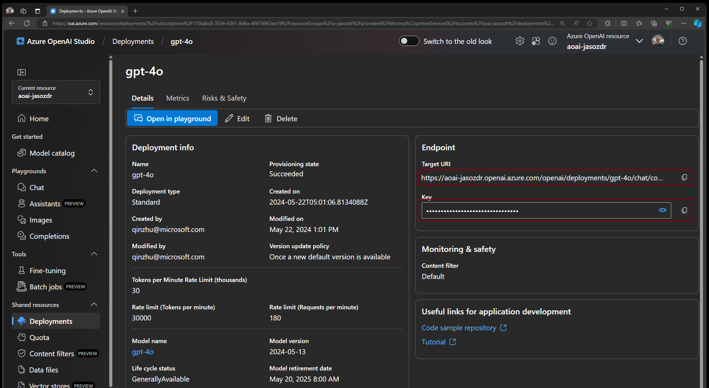

2. As in the last screenshot, you can retrieve your chat completion endpoint in the `Target URI` property in the `Endpoint` section.
 
3. You can retrieve your API key from the `Key` property in the `Endpoint` section. After you copy the API key, **fill it in the format of `api-key: <YOUR_API_KEY>` for authentication header** in AI Toolkit. See [Azure OpenAI service documentation](https://learn.microsoft.com/en-us/azure/ai-services/openai/reference#request-header-2) to learn more about the authentication header.

#### Example 2: OpenAI

1. For now, the chat completion endpoint is fixed as `https://api.openai.com/v1/chat/completions`. See [OpenAI documentation](https://platform.openai.com/docs/api-reference/chat/create) to learn more about it.

2. Go to [OpenAI documentation](https://platform.openai.com/docs/api-reference/authentication) and click `API Keys` or `Project API Keys` to create or retrieve your API key. After you copy the API key, **fill it in the format of `Authorization: Bearer <YOUR_API_KEY>` for authentication header** in AI Toolkit. See the OpenAI documentation for more information.

    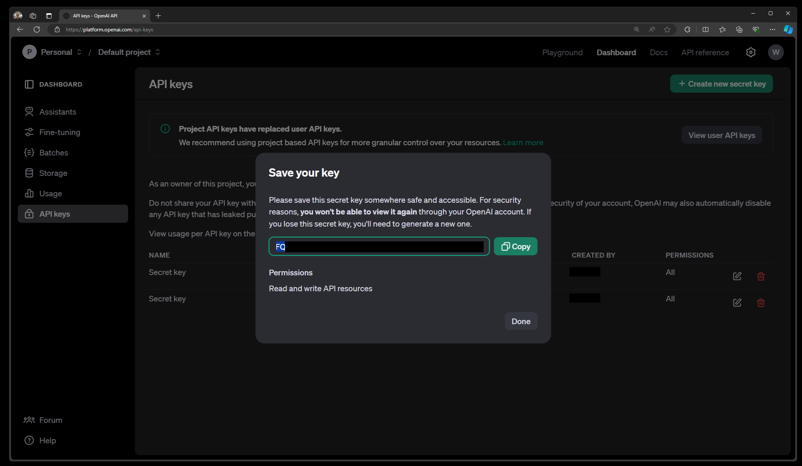

### How to edit endpoint URL or authentication header?

If you enter the wrong endpoint or authenticatin header, you may encounter errors when inferencing. Click `Edit settings.json` to open Visual Studio Code settings. You may also type the command `Open User Settings (JSON)` in Visual Studio Code command palette to open it and go to the `windowsaistudio.remoteInfereneEndpoints` section.

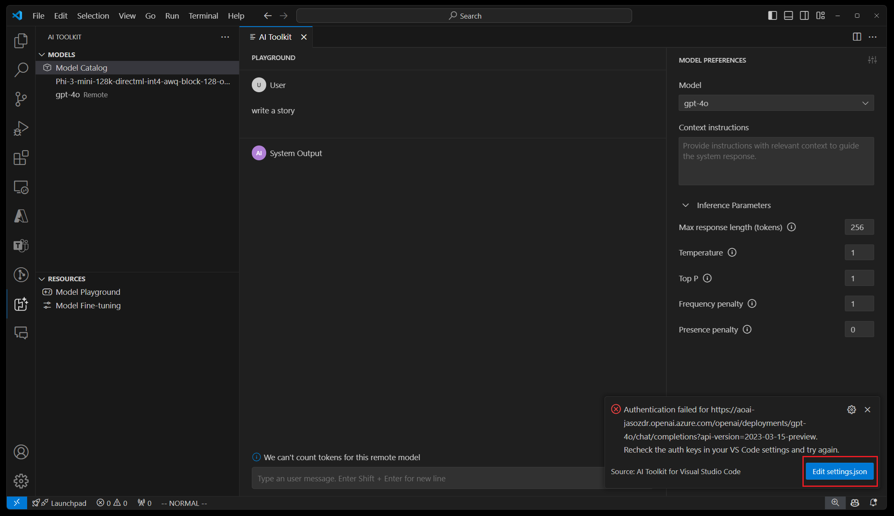

Here, you can edit or remove existing endpoint URLs or authentication headers. After you save the settings, the models list in tree view or playground will automatically refresh.

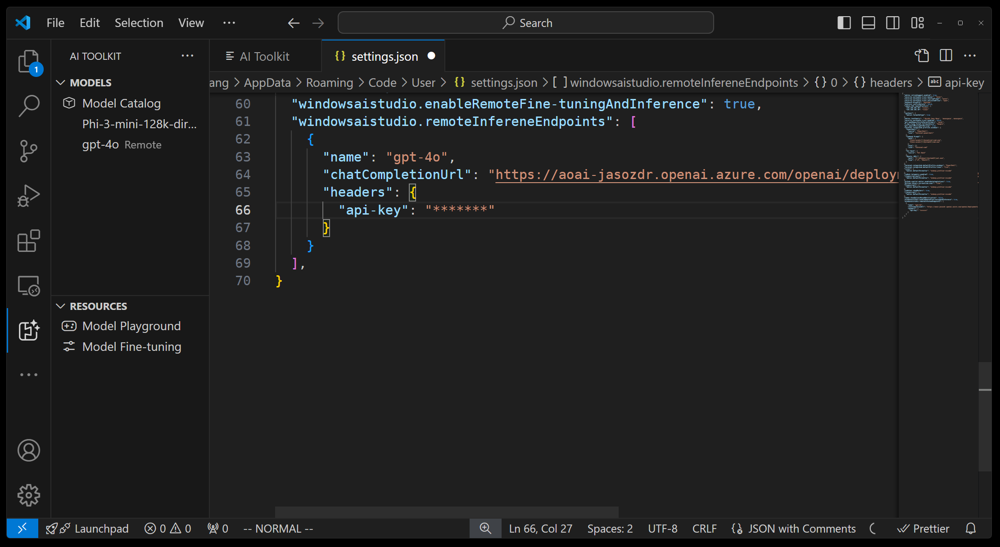