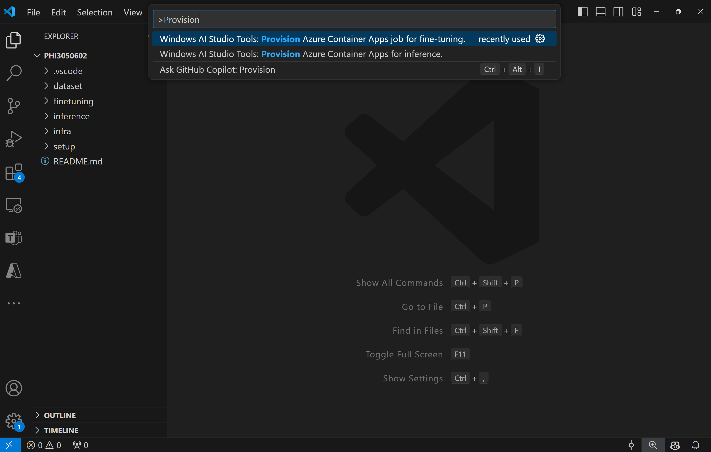
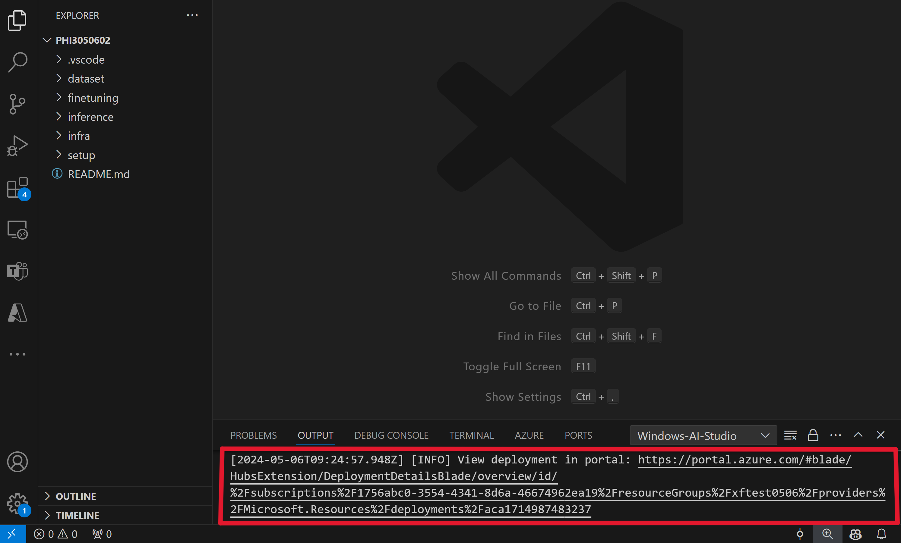
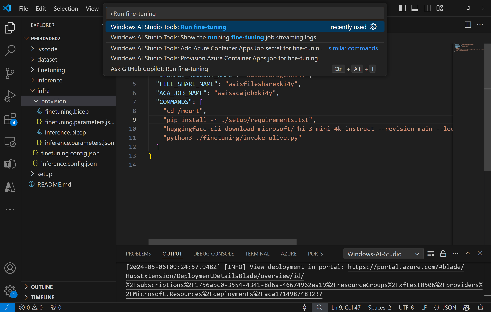
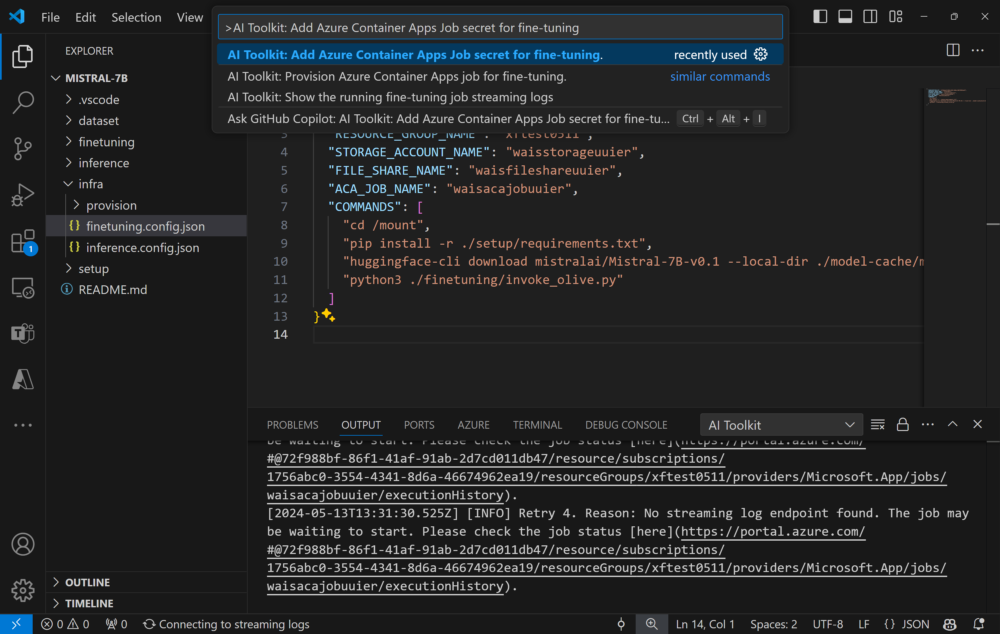
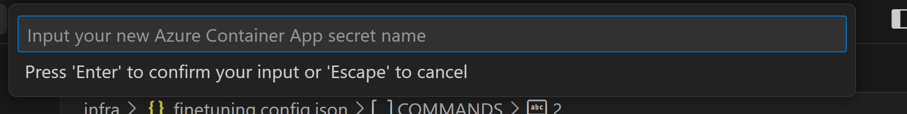
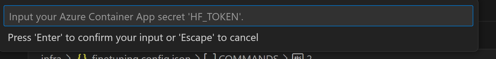

# Fine-Tuning models remotely
Model fine-tuning in machine learning involves subtly adjusting a pre-existing model, which was initially trained on a larger dataset, to perform a similar but new task using a smaller dataset. If you lack local computing resources, such as a GPU, you can perform this fine-tuning remotely using AI Toolkit and Azure Container App.

## Prerequisites
1. To run the model fine-tuning in your remote Azure Container App Environment, you need to make sure your subscription have enough GPU capacity amount. Submit a [support ticket](https://azure.microsoft.com/support/create-ticket/) to request the capacity amount required for your application. [Learn More about GPU capacity](https://learn.microsoft.com/en-us/azure/container-apps/workload-profiles-overview)
2. Make sure you have a [HuggingFace account](https://huggingface.co/) and [generate an access token](https://huggingface.co/docs/hub/security-tokens) if you are using private dataset on HuggingFace or your base model needs access control.
3. Accept the LICENSE on HuggingFace if you are fine-tuning Mistral or Llama. 
4. If you enable [Weights & Biases](https://wandb.ai/site), make sure you have a Weights & Biases account and [retrieve your API Key](https://wandb.ai/authorize)

## Provision Azure Resources
To get started, you need provision the Azure Resource for remote fine-tuning. This can be done by running the `AI Toolkit: Provision Azure Container Apps job for fine-tuning.` from command palette. During this process, you will be prompted to select your Azure Subscription and resource group.



You can monitor the progress of the provision via the link that is displayed in the output channel.


## Run
To start the remote fine-tuning job, execute the `AI Toolkit: Run fine-tuning` command.


Upon running this command, the extension will do the following operations:
1. Synchronize your workspace with Azure Files.
1. Start the ACA job using the commands specified in `./infra/fintuning.config.json`.
1. Display the job streaming log if the job has started running. 
    
    > **Note:** The job might be queued if there are insufficient resources available. If the log fails to display when the job starts, you can wait for a while and then execute the `AI Toolkit: Show the running fine-tuning job streaming logs` command to re-connect to the streaming log.
    
During this process, QLoRA will be used for fine-tuning, and will create LoRA adapters for the model to use during inference.
The results of the fine-tuning will be stored in the Azure Files.

## View and Query Logs on Azure

After fine-tuning job was triggered, you can also view logs on Azure by clicking the "*Open Logs in Azure Portal*" button from the VSCode notification.

Or, if you already opened the Azure Portal, you can find job history from the "*Execution history*" panel to the Azure Container Apps job.


There are two types of logs, "*Console*" and "*System*".
- Console logs, which are emitted by your app, including `stderr` and `stdout` messages. That's also what you may already see in previous section's streaming logs.
- System logs, which are emitted by the Container Apps service, including the status of service level events.

To view and query you logs, clicking the "*Console*" button and you will be navigated to the Log Analytics page. There you can view all the logs and write your own queries.


> For more information about Azure Container App Logs, see [Application Logging in Azure Container Apps](https://learn.microsoft.com/azure/container-apps/logging).

## Provisioning Components Included in the Template
 
| Folder | Contents |
| ------ |--------- |
| `infra` | Contains all necessary configurations for remote operations. |
| `infra/provision/finetuning.parameters.json` | Holds parameters for the bicep templates, used for provisioning Azure resources for fine-tuning. |
| `infra/provision/finetuning.bicep` | Contains templates for provisioning Azure resources for fine-tuning. |
| `infra/finetuning.config.json` |The configuration file, generated by the `AI Toolkit: Provision Azure Container Apps job for fine-tuning.` command. It is used as input for other remote command palettes. |

## Advanced usage
### Configuring Secrets for fine-tuning in Azure Container Apps
Azure Container App Secrets offer a secure way to store and manage sensitive data within Azure Container Apps. This feature fulfills the need for a secure environment to handle sensitive data such as HuggingFace tokens and Weights & Biases API keys. If you need to set these values, AI Toolkit provides a command palette to input the secrets into the provisioned Azure container app job (as stored in `./finetuning.config.json`). These secrets are then set as **environment variables** in all the containers.

#### Steps:
1. In the Command Palette, type and select `AI Toolkit: Add Azure Container Apps Job secret for fine-tuning.`


1. Input Secret Name and Value: You'll be prompted to input the name and value of the secret.
   
   
   For example, [HF_TOKEN](https://huggingface.co/docs/huggingface_hub/package_reference/environment_variables#hftoken) is used to authenticate the user to the Hugging Face Hub, removing the need for manual user login. If your project contains datasets or models that need Hugging Face access control, set the secret name to be `HF_TOKEN` and the secret value to be your Hugging Face token.

After you've set up the secret, you can now use it in your Azure Container App. The secret will be set in the environment variables of your container app.

### Configuring Azure Resource Provision
This guide will help you configure the `AI Toolkit: Provision Azure Container Apps job for fine-tuning.` command.

You can find configuration parameters in `./infra/provision/finetuning.parameters.json` file. Here are the details:
| Parameter | Description |
| --------- |------------ |
| `defaultCommands` | This is the default command to start a fine-tuning job. It can be overwritten in `./infra/finetuning.config.json`. |
| `maximumInstanceCount` | This parameter sets the maximum capacity of GPU instances. |
| `timeout` | This sets the timeout for the ACA fine-tuning job in seconds. The default value is 10800, which equals to 3 hours. If the ACA job reaches this timeout, the fine-tuning process halts. However, checkpoints are saved by default, allowing the fine-tuning process to resume from the last checkpoint instead of starting over if it is run again. |
| `location` | This is the location where Azure resources are provisioned. The default value is the same as the chosen resource group's location. |
| `storageAccountName`, `fileShareName` `acaEnvironmentName`, `acaEnvironmentStorageName`, `acaJobName`,  `acaLogAnalyticsName` | These parameters are used to name the Azure resources for provision. You can input a new, unused resource name to create your own custom-named resources, or you can input the name of an already existing Azure resource if you'd prefer to use that. For details, refer to the section [Using existing Azure Resources](#using-existing-azure-resources). |

#### Using existing Azure Resources
If you have existing Azure resources that need to be configured for fine-tuning, you can specify their names in the `./infra/provision/finetuning.parameters.json` file and then run the `AI Toolkit: Provision Azure Container Apps job for fine-tuning.` from the command palette. This will update the resources you've specified and create any that are missing.

For example, if you have an existing Azure container environment, your `./infra/finetuning.parameters.json` should look like this:

```json
{
    "$schema": "https://schema.management.azure.com/schemas/2019-04-01/deploymentParameters.json#",
    "contentVersion": "1.0.0.0",
    "parameters": {
      ...
      "acaEnvironmentName": {
        "value": "<your-aca-env-name>"
      },
      "acaEnvironmentStorageName": {
        "value": null
      },
      ...
    }
  }
```

### Manual Provision
If you prefer to manually set up the Azure resources, you can use the provided bicep files in the `./infra/provision` folders. If you've already set up and configured all the Azure resources without using the AI Toolkit command palette, you can simply enter the resource names in the `finetune.config.json` file.

For example:

```json
{
  "SUBSCRIPTION_ID": "<your-subscription-id>",
  "RESOURCE_GROUP_NAME": "<your-resource-group-name>",
  "STORAGE_ACCOUNT_NAME": "<your-storage-account-name>",
  "FILE_SHARE_NAME": "<your-file-share-name>",
  "ACA_JOB_NAME": "<your-aca-job-name>",
  "COMMANDS": [
    "cd /mount",
    "pip install -r ./setup/requirements.txt",
    "huggingface-cli download <your-model-name> --local-dir ./model-cache/<your-model-name> --local-dir-use-symlinks False",
    "python3 ./finetuning/invoke_olive.py"
  ]
}
```
