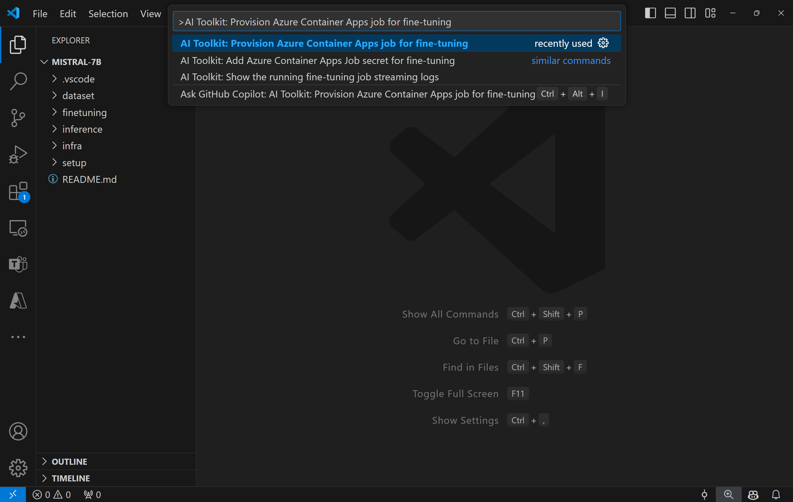
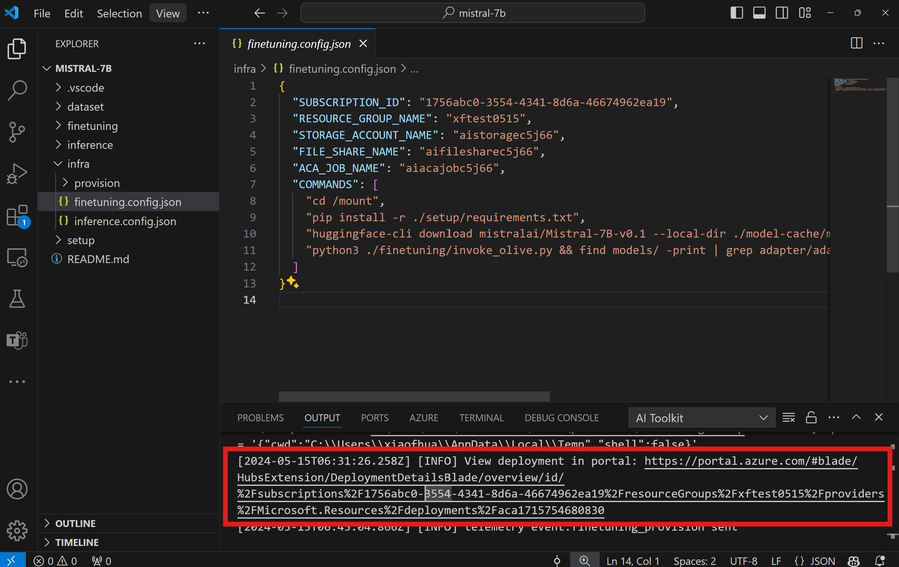
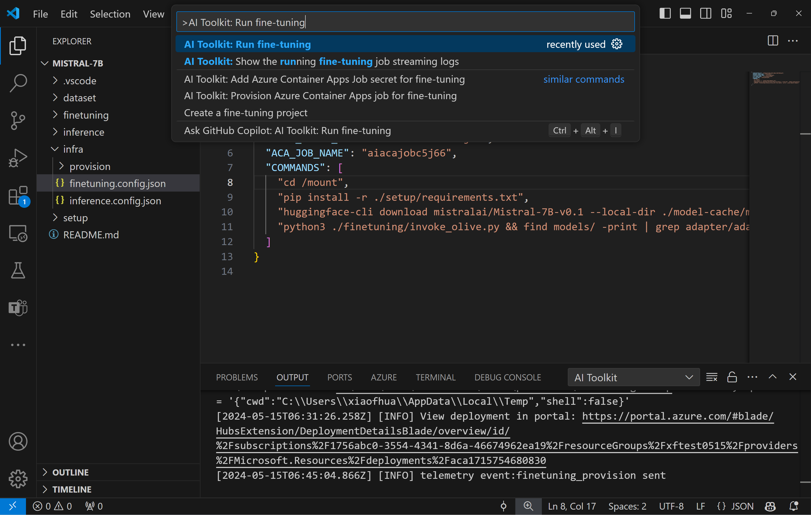
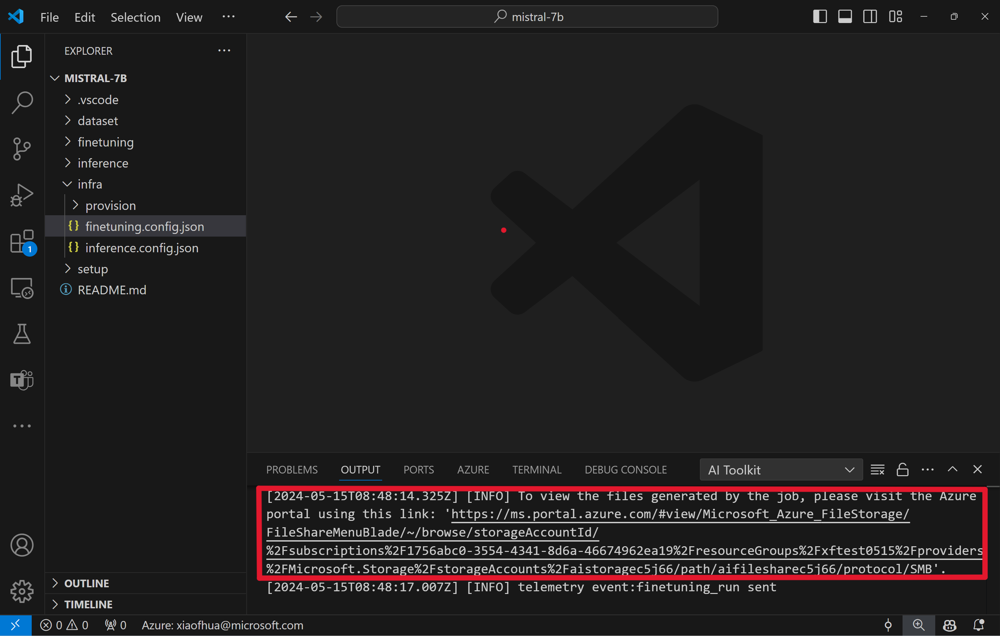
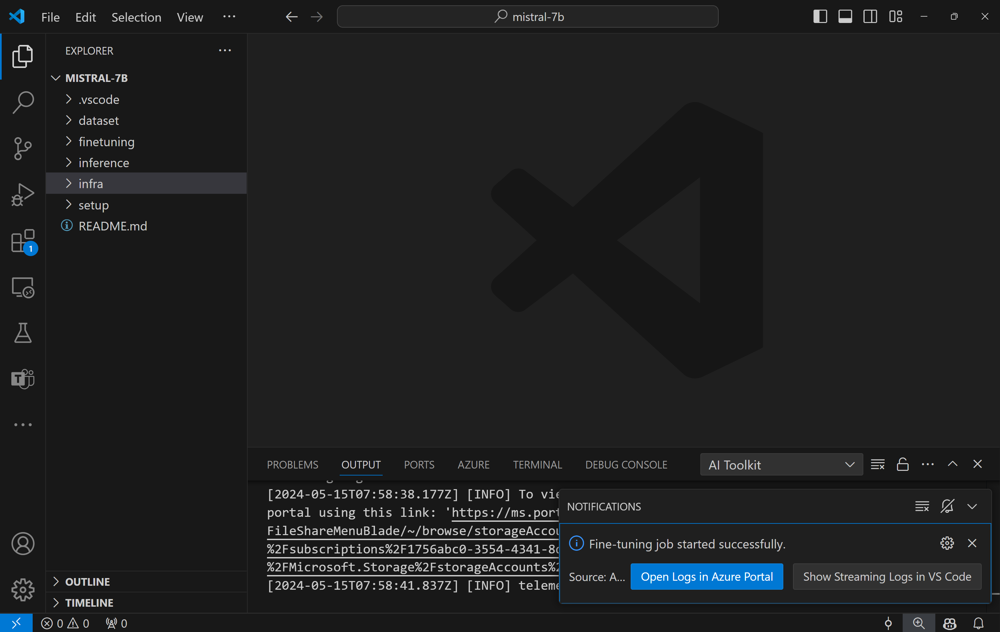
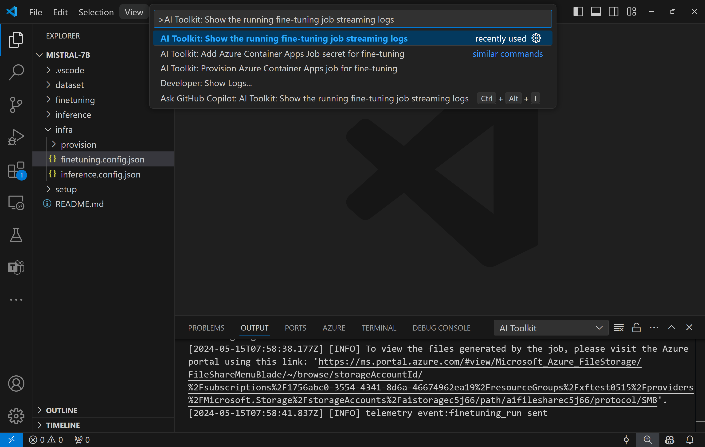
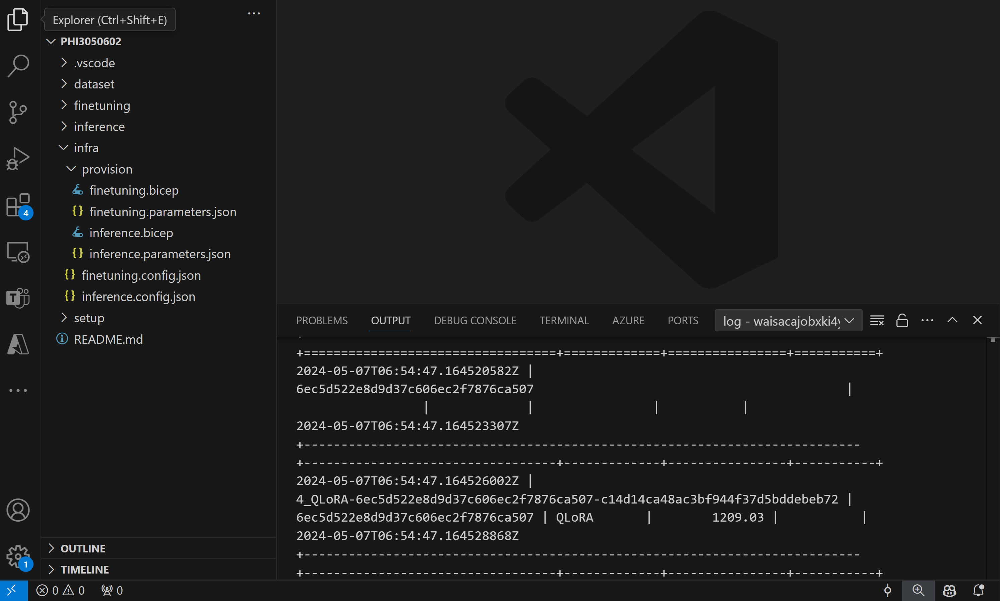
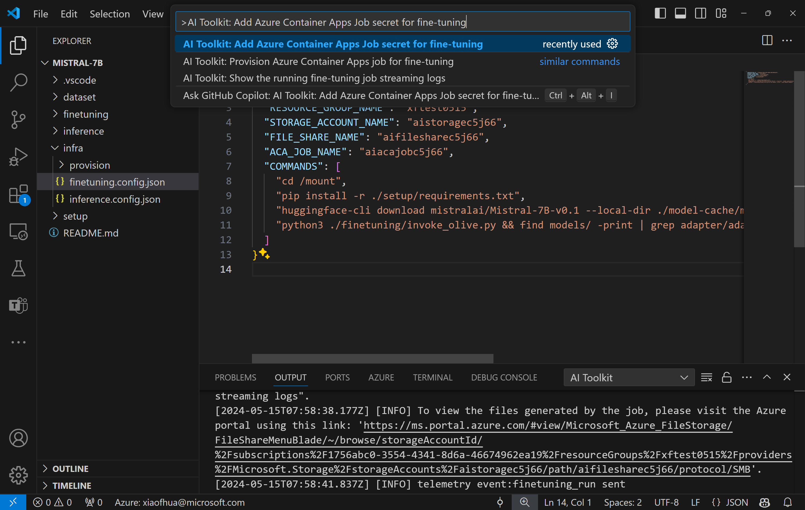

# Fine-Tuning models remotely
Model fine-tuning in machine learning involves subtly adjusting an existing model, originally trained on a larger dataset, to perform a similar but new task using a smaller dataset. If you don't have local computing resources like a GPU, you can do this fine tuning remotely with AI Toolkit and Azure Container App.

## Provision Azure Resources
To get started, you need to provision the Azure Resource for remote fine-tuning. Do this by running the `AI Toolkit: Provision Azure Container Apps job for fine-tuning` from the command palette. During this process, you will be prompted to select your Azure Subscription and resource group.



Monitor the progress of the provision through the link displayed in the output channel.


## Run
To start the remote fine-tuning job, execute the `AI Toolkit: Run fine-tuning` command.


Upon running this command, the extension will do the following operations:
1. Synchronize your workspace with Azure Files.
1. Trigger the Azure Container Appjob using the commands specified in `./infra/fintuning.config.json`.

During this process, QLoRA will be used for fine-tuning, and will create LoRA adapters for the model to use during inference.

The results of the fine-tuning will be stored in the Azure Files.
To explore the output files in the Azure File share, you can navigate to the Azure portal using the link provided in the output panel. Alternatively, you can directly access the Azure portal and locate the storage account named `STORAGE_ACCOUNT_NAME` as defined in `./infra/fintuning.config.json` and the file share named `FILE_SHARE_NAME` as defined in `./infra/fintuning.config.json`.  



### View Logs
Once the fine-tuning job has been started, you can access the system and console logs by visiting the Azure portal. 
Alternatively, you can view the console logs directly in the VSCode output panel.
> **Note:** The job might take a few minutes to initiate. If there is already a running job, the current one may be queued to start later.



#### View and Query Logs on Azure

After fine-tuning job was triggered, you can view logs on Azure by clicking the "*Open Logs in Azure Portal*" button from the VSCode notification.

Or, if you've already opened the Azure Portal, find job history from the "*Execution history*" panel to the Azure Container Apps job.


There are two types of logs, "*Console*" and "*System*".
- Console logs are messages from your app, including `stderr` and `stdout` messages. This is what you might have already seen in the streaming logs section.
- System logs are messages from the Container Apps service, including the status of service-level events.

To view and query your logs, click the "*Console*" button and navigate to the Log Analytics page where you can view all logs and write your queries.


> For more information about Azure Container Apps Logs, see [Application Logging in Azure Container Apps](https://learn.microsoft.com/azure/container-apps/logging).


#### View streaming logs in VSCode
After initiating the fine-tuning job, you can also view logs on Azure by clicking on the "*Show Streaming Logs in VS Code*" button in the VSCode notification.
Or you can execute the command `AI Toolkit: Show the running fine-tuning job streaming logs`.


The streaming log of the running fine-tuning job will be displayed in the output panel.



> **Note:** 
> 1. The job might be queued due to insufficient resources. If the log is not displayed, wait for a while and then execute the command to re-connect to the streaming log.
> 2. The streaming log may timeout and disconnect. However, it can be reconnected by execute the command again.

## Fine-tuning Components Included in the Template
 
| Folder | Contents |
| ------ |--------- |
| `infra` | Contains all necessary configurations for remote operations. |
| `infra/provision/finetuning.parameters.json` | Holds parameters for the bicep templates, used for provisioning Azure resources for fine-tuning. |
| `infra/provision/finetuning.bicep` | Contains templates for provisioning Azure resources for fine-tuning. |
| `infra/finetuning.config.json` |The configuration file, generated by the `AI Toolkit: Provision Azure Container Apps job for fine-tuning` command. It is used as input for other remote command palettes. |

## Advanced usage
### Configuring Secrets for fine-tuning in Azure Container Apps
Azure Container App Secrets provide a secure way to store and manage sensitive data within Azure Container Apps, like HuggingFace tokens and Weights & Biases API keys. Using AI toolkit's command palette, you can input the secrets into the provisioned Azure container app job(as stored in `./finetuning.config.json`). These secrets are then set as **environment variables** in all containers.

#### Steps:
1. In the Command Palette, type and select `AI Toolkit: Add Azure Container Apps Job secret for fine-tuning`


1. Input Secret Name and Value: You'll be prompted to input the name and value of the secret.
   
   
   For example, if you're using private HuggingFace dataset or models that need Hugging Face access control, set your HuggingFace token as an environment variable [`HF_TOKEN`](https://huggingface.co/docs/huggingface_hub/package_reference/environment_variables#hftoken) to avoid the need for manual login on the Hugging Face Hub.

After you've set up the secret, you can now use it in your Azure Container App. The secret will be set in the environment variables of your container app.

### Configuring Azure Resource Provision
This guide will help you configure the `AI Toolkit: Provision Azure Container Apps job for fine-tuning` command.

You can find configuration parameters in `./infra/provision/finetuning.parameters.json` file. Here are the details:
| Parameter | Description |
| --------- |------------ |
| `defaultCommands` | This is the default command to start a fine-tuning job. It can be overwritten in `./infra/finetuning.config.json`. |
| `maximumInstanceCount` | This parameter sets the maximum capacity of GPU instances. |
| `timeout` | This sets the timeout for the Azure Container Appfine-tuning job in seconds. The default value is 10800, which equals to 3 hours. If the Azure Container Appjob reaches this timeout, the fine-tuning process halts. However, checkpoints are saved by default, allowing the fine-tuning process to resume from the last checkpoint instead of starting over if it is run again. |
| `location` | This is the location where Azure resources are provisioned. The default value is the same as the chosen resource group's location. |
| `storageAccountName`, `fileShareName` `acaEnvironmentName`, `acaEnvironmentStorageName`, `acaJobName`,  `acaLogAnalyticsName` | These parameters are used to name the Azure resources for provision. You can input a new, unused resource name to create your own custom-named resources, or you can input the name of an already existing Azure resource if you'd prefer to use that. For details, refer to the section [Using existing Azure Resources](#using-existing-azure-resources). |

#### Using existing Azure Resources
If you have existing Azure resources that need to be configured for fine-tuning, you can specify their names in the `./infra/provision/finetuning.parameters.json` file and then run the `AI Toolkit: Provision Azure Container Apps job for fine-tuning` from the command palette. This will update the resources you've specified and create any that are missing.

For example, if you have an existing Azure container environment, your `./infra/finetuning.parameters.json` should look like this:

```json
{
    "$schema": "https://schema.management.azure.com/schemas/2019-04-01/deploymentParameters.json#",
    "contentVersion": "1.0.0.0",
    "parameters": {
      ...
      "acaEnvironmentName": {
        "value": "<your-aca-env-name>"
      },
      "acaEnvironmentStorageName": {
        "value": null
      },
      ...
    }
  }
```

### Manual Provision
If you prefer to manually set up the Azure resources, you can use the provided bicep files in the `./infra/provision` folders. If you've already set up and configured all the Azure resources without using the AI Toolkit command palette, you can simply enter the resource names in the `finetune.config.json` file.

For example:

```json
{
  "SUBSCRIPTION_ID": "<your-subscription-id>",
  "RESOURCE_GROUP_NAME": "<your-resource-group-name>",
  "STORAGE_ACCOUNT_NAME": "<your-storage-account-name>",
  "FILE_SHARE_NAME": "<your-file-share-name>",
  "ACA_JOB_NAME": "<your-aca-job-name>",
  "COMMANDS": [
    "cd /mount",
    "pip install -r ./setup/requirements.txt",
    "huggingface-cli download <your-model-name> --local-dir ./model-cache/<your-model-name> --local-dir-use-symlinks False",
    "python3 ./finetuning/invoke_olive.py && find models/ -print | grep adapter/adapter"
  ]
}
```
