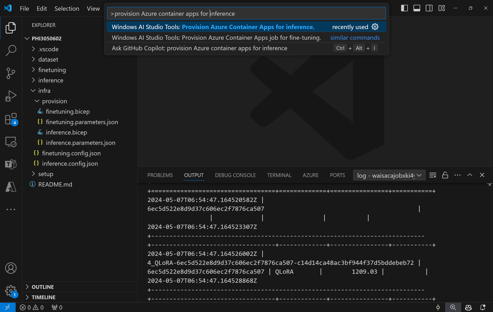
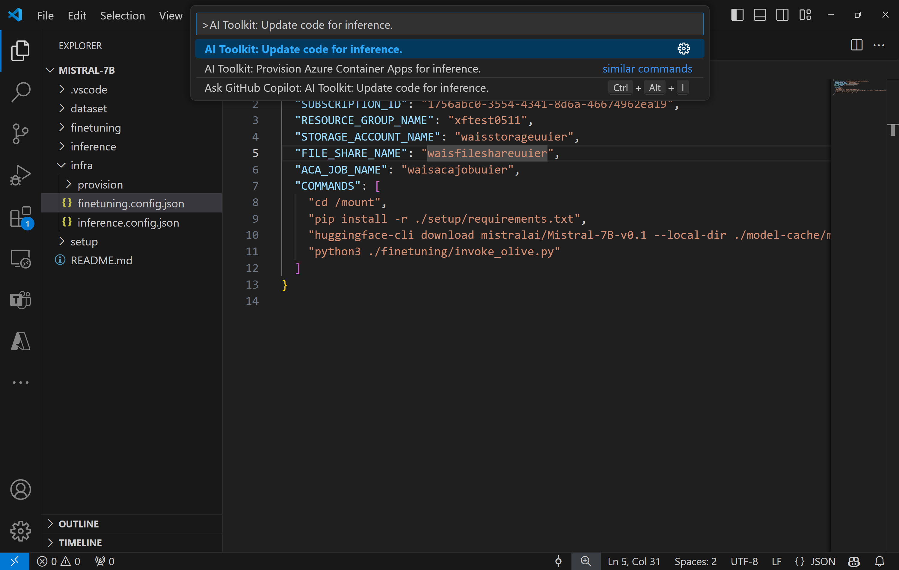

# Inferencing with the fine-tuned model
After the adapters are trained in the remote environment, you can use a simple Gradio application to interact with the model.  

## Provision Azure Resources
Similar to the fine-tuning process, you need to set up the Azure Resources for remote inference by executing the `Windows AI Studio Tools: Provision Azure Container Apps for inference` from the command palette. During this setup, you will be asked to select your Azure Subscription and resource group.  

   
By default, if you select the same resource group as for fine-tuning, the inference will use the same Azure Container App Environment and the same files stored in Azure Files. The Azure Container App will initiate a web API with the command configured in `./infra/provision/inference.parameters.json`  

Once provisioning is successfully completed, you can find the web API endpoint under `ACA_APP_ENDPOINT` within `./infra/inference.config.json`. You are now ready to evaluate the model using this endpoint.

## Advanced usage
### Modifying the Inference Code  
If you wish to revise the inference code, please execute the `Windows AI Studio Tools: Update code for inference` command. This will synchronize your latest code with ACA and restart the replica.  

   
### Using Existing Azure Resources  
If you have existing Azure resources that need to be set up for inference, you can specify their names in the `./infra/inference.parameters.json` file and then run the `Windows AI Studio Tools: Provision Azure Container Apps for inference` command from the command palette. This will update the resources you've identified and create any that are missing.  
   
### Manual Provision  
If you prefer to manually configure the Azure resources, you can use the provided bicep files in the `./infra/provision` folders. If you have already set up and configured all the Azure resources without using the Windows AI Studio Visual Studio Code Extension command palette, you can simply enter the resource names in the `inference.config.json` file.

