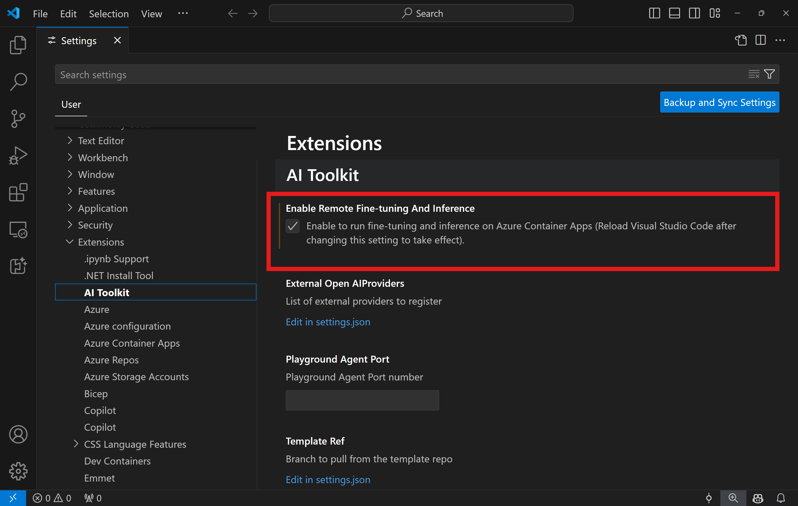
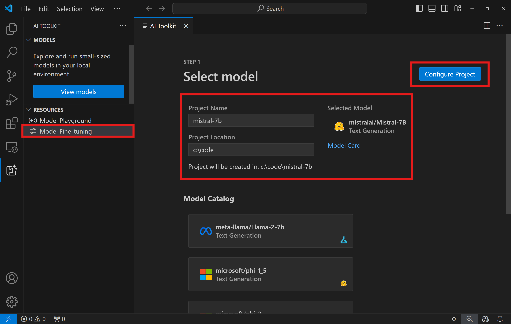
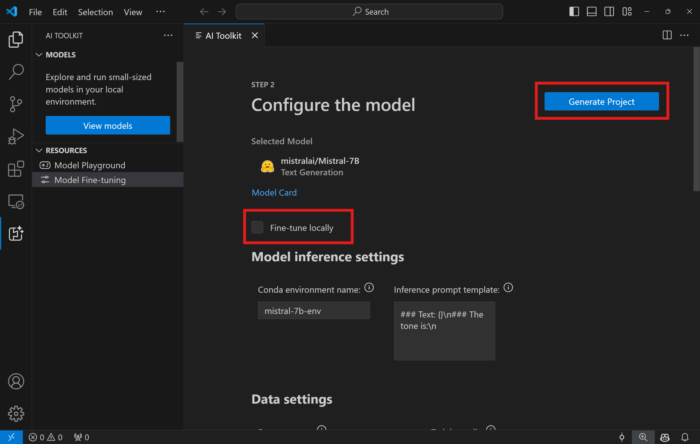

# **[Private Preview]** Introducing Remote Development with AI Toolkit for VS Code

In addition to local development, the AI Toolkit for VS Code now supports remote development. This feature enables users to provision for Azure Container Apps to run model fine-tuning and inference endpoint in the cloud.

## Prerequisites
1. To run the model fine-tuning and inference in your remote Azure Container Apps Environment, make sure your subscription has enough GPU capacity. Submit a [support ticket](https://azure.microsoft.com/support/create-ticket/) to request the required capacity for your application. [Get More Info about GPU capacity](https://learn.microsoft.com/en-us/azure/container-apps/workload-profiles-overview)
2. Make sure you have a [HuggingFace account](https://huggingface.co/) and [generate an access token](https://huggingface.co/docs/hub/security-tokens) if you are using private dataset on HuggingFace or your base model needs access control.
3. Accept the LICENSE on HuggingFace if you are fine-tuning Mistral or Llama. 
4. Enable Remote Fine-tuning and Inference feature flag in the AI Toolkit for VS Code
   1. Open the VS Code Settings by selecting *File -> Preferences -> Settings*.
   2. Navigate to *Extensions* and select *AI Toolkit*.
   3. Select the *"Enable Remote Fine-tuning And Inference"* option.
   4. Reload VS Code for the changes to take effect.
   

## Setting Up a Remote Development Project
1. Execute the command palette `AI Toolkit: Focus on Resource View`.

2. Navigate to *Model Fine-tuning* to access the model catalog. Assign a name to your project and select its location on your machine. Then, hit the *"Configure Project"* button.

3. Project Configuration
    1. Avoid enabling the *"Fine-tune locally"* option.
    2. The Olive configuration settings will appear with pre-set default values. Please adjust and fill in these configurations as required.
    3. Move on to *Generate Project*. This stage leverages WSL and involves setting up a new Conda environment, preparing for future updates that include Dev Containers.

4. Click on *"Relaunch Window In Workspace"* to open your remote development project.

> **Note:** The project currently works either locally or remotely within the AI Toolkit for VS Code. If you choose *"Fine-tune locally"* during project creation, it will operate exclusively in WSL without remote development capabilities. On the other hand, if you forego enabling *"Fine-tune locally"*, the project will be restricted to the remote Azure Container App environment.

## What's Next
Refer to [Fine-Tuning models remotely](./remote-finetuning.md) for instructions on how to fine-tune a model in Azure Container Apps.
To learn how to create an inference API endpoint in Azure Container Apps, see I[Inferencing with the fine-tuned model](./remote-inference.md).

