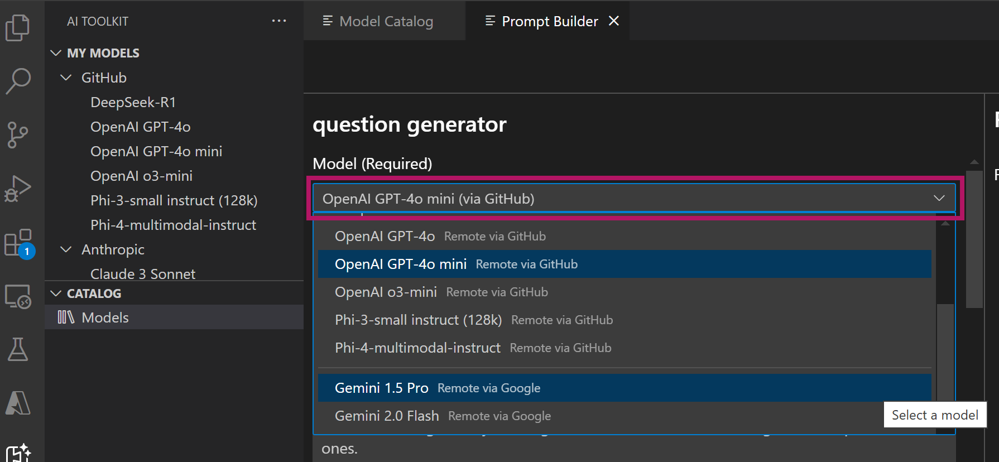
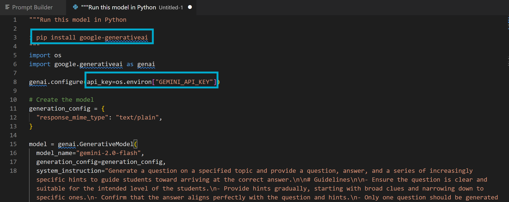

# Change Model and Integrate into Code

This tutorial shows how to modify the Question Generator app to use different AI models available in the AI Toolkit model catalog.

The AI Toolkit supports multiple model providers including:
- GitHub-hosted models (Llama3, Phi-3, Mistral models)
- Publisher-hosted models (OpenAI ChatGPT models, Anthropic Claude, Google Gemini)
- Locally downloaded models, for example from HuggingFace
- Locally running Ollama models

You'll learn how to:
- Add different models from the Model Catalog
- Change the model in Prompt builder
- View code and update the app code for your chosen model
- Test the changes

## Prerequisites
- Completed the basic Question Generator tutorial
- AI Toolkit VS Code extension installed
- Access to desired model providers (e.g., Anthropic API key for Claude)

## Steps

### 1. Choose a Model
Refer to [this document](https://code.visualstudio.com/docs/intelligentapps/models) for instructions on adding a model from the AI Toolkit Model Catalog.

### 2. Select and Test the Model in Prompt Builder
1. Open the **Prompt Builder** in the AI Toolkit sidebar.
2. Browse the available models and select one to use.

3. Copy the system prompt from [final_prompt.txt](./final_prompt.txt) and input it.
4. Enter a user prompt to test the new model, for example:
    ```text
    Create an intermediate level mathematical question for a grade 8 student.
    ```
5. Verify if the response works as expected.

### 3. Export Code
Once you are satisfied with the response, export the code and update it in the sample app.
1. Click `View Code` to open the code sample in VS Code editor.
2. Copy the code sample to the `chat` API in [app.py](app.py).
3. Depending on your chosen model, install requirement Python package(s) and set the API key if needed.

