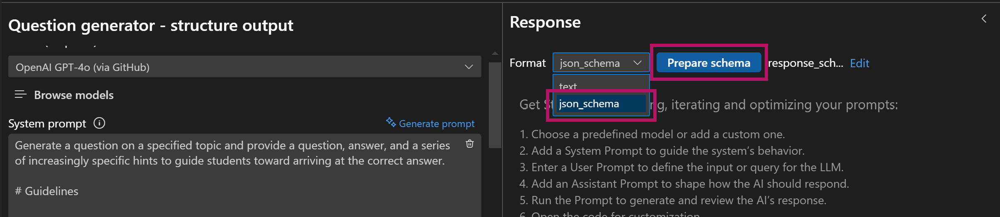
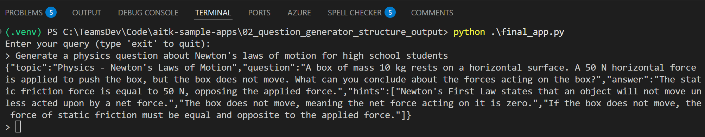

# Adding Structured Outputs using JSON Schema

When building AI applications, getting consistent, machine-readable responses is crucial. Unstructured text responses:
- Require complex parsing logic
- Can vary in format between responses
- May include unwanted information
- Are difficult to validate

Structured Outputs is a feature that ensures the model will always generate responses that adhere to your supplied [JSON Schema](https://json-schema.org/overview/what-is-jsonschema). Modern AI models like GPT-4o, and Gemini support JSON mode, allowing you to define the exact structure you want.

In this tutorial, you will learn how to improve your AI application's output by utilizing AI Toolkit's **Structured Outputs** feature.

## Adding Structured Outputs to the Question Generator

Remember the [question generator app](../01_question_generator/README.md) we built earlier? In that app, we used prompt engineering with samples and instructions to guide the AI to generate markdown output in this format:

- **Topic**: Mathematics
- **Question:** What is the smallest prime number?
- **Answer:** 2
- **Hints:**
    1. It is the first even number in the list of prime numbers.
    2. A prime number can only be divided by 1 and itself, and this number is less than 3.
    3. It is the only even number that is also a prime.

Now, let's improve our application by implementing structured outputs using JSON schema, which will make the responses more consistent and easier to process programmatically.

### Step 1: Define Your Schema
First, create a schema file that describes the exact response format for the generated educational questions:

> NOTE: JSON schema formats may differ slightly between different model providers.

- Example schema used with Open AI models:
  ```json
  {
    "name": "Question_Generator",
    "strict": true,
    "schema": {
      "type": "object",
      "description": "Schema for educational questions with hints and answers",
      "properties": {
        "topic": {
          "type": "string",
          "description": "The academic subject of the question"
        },
        "question": {
          "type": "string",
          "description": "The educational question to be answered"
        },
        "answer": {
          "type": "string",
          "description": "The correct answer to the question"
        },
        "hints": {
          "type": "array",
          "description": "List of progressive hints to help solve the question",
          "items": {
            "type": "string"
          }
        }
      },
      "required": [
        "topic",
        "answer",
        "question",
        "hints"
      ],
      "additionalProperties": false
    }
  }
  ```
- Example schema used with Google Gemini models:
  ```json
  {
      "type": "object",
      "description": "Schema for educational questions with hints and answers",
      "properties": {
          "topic": {
              "type": "string",
              "description": "The academic subject of the question"
          },
          "question": {
              "type": "string",
              "description": "The educational question to be answered"
          },
          "hints": {
              "type": "array",
              "description": "List of progressive hints to help solve the question",
              "items": {
                  "type": "string"
              }
          },
          "answer": {
              "type": "string",
              "description": "The correct answer to the question"
          }
      },
      "required": [
          "topic",
          "question",
          "answer",
          "hints",
      ]
  }
  ```

### Step 2: Update Your Prompt
Modify the existing system prompt to maintain consistency with structured output:
- Remove the `# Output Format` section since we're specifying a JSON schema when calling the chat completion API
- Update the examples to JSON format

  ```text
  # Examples
  ### Example 1: Topic - Astronomy
  {
    "topic": "Astronomy",
    "question": "What is the largest planet in the Solar System?",
    "answer": "Jupiter",
    "hints": [
      "This planet is known for its massive size and its many moons.",
      "It is a gas giant located between Mars and Saturn.",
      "It has a famous Great Red Spot, a giant storm visible from Earth."
    ]
  }

  ### Example 2: Topic - Mathematics
  {
    "topic": "Mathematics",
    "question": "What is the smallest prime number?",
    "answer": "2",
    "hints": [
      "It is the first even number in the list of prime numbers.",
      "A prime number can only be divided by 1 and itself, and this number is less than 3.",
      "It is the only even number that is also a prime."
    ]
  }

  ### Example 3: Topic - Chemical Thermodynamics
  {
    "topic": "Chemical Thermodynamics",
    "question": "A reaction has a ΔG° = -45.0 kJ/mol at 298 K. What is the equilibrium constant (K) for this reaction? R = 8.314 J/(mol·K).",
    "answer": "Approximately 3.9 × 10^7",
    "hints": [
      "Recall the relationship between the standard Gibbs free energy change (ΔG°) and the equilibrium constant (K): ΔG° = -RT ln K.",
      "Substitute the values: R = 8.314 J/(mol·K), T = 298 K, ΔG° = -45.0 × 10^3 J/mol. Rearrange the formula to solve for K.",
      "Solve: First, calculate ln K = -ΔG°/(RT). Then take the exponential of the result using K = e^ln K. After calculations, you should find K ≈ 3.9 × 10^7."
    ]
  }
  ```

Here is the final prompt: [final_prompt.txt](./final_prompt.txt)

### Step 3: Test the prompt

To test whether your prompt works correctly with the JSON schema:

1. Open the **Prompt Builder** in the AI Toolkit sidebar.
2. Enter your system prompt from [final_prompt.txt](./final_prompt.txt).
3. Configure the response format:
   - Click on the **Response Format** dropdown and select `json_schema`.
   
   - Click the **Prepare schema** button.
   - Choose **Use local file** and select either [response_schema_openai.json](./response_schema_openai.json) (for OpenAI models) or [response_schema_gemini.json](response_schema_gemini.json) (for Gemini models) based on which model you're using.
4. Enter a test query in the **User prompt** field, such as:
    ```text
    Generate a physics question about Newton's laws of motion for high school students
    ```

5. Click **Run** to see the response.

6. Verify that:
    - The response is properly formatted as JSON
    - All required fields are present (topic, question, hints, answer)
    - The JSON is valid and matches the schema structure, below is an example response:

    ```json
    {
      "topic": "Physics - Newton's Laws of Motion",
      "question": "A 5 kg box is pushed across a frictionless surface with a constant force of 20 N. What is the acceleration of the box?",
      "answer": "4 m/s²",
      "hints": [
        "Remember Newton's second law of motion states that force is equal to mass times acceleration (F = ma).",
        "You have the mass of the box and the total force applied to it, so you can rearrange the equation to solve for acceleration (a = F/m).",
        "To find the acceleration, divide the force of 20 N by the mass of the box which is 5 kg."
      ]
    }
    ```

### Step 4: Update App Code
Now that you've validated your schema works correctly, let's integrate structured outputs into the application code:

1. In the `Prompt Builder`, click the `View Code` button to generate a code sample in VS Code.
2. Copy the generated code and replace the existing implementation in the `chat(user_query)` method in [app.py](./app.py).
3. Ensure the last user message sent to the model to use the `user_query` variable as input:
  - For Azure OpenAI or OpenAI models:
    ```python
    UserMessage(content=[
        TextContentItem(text=user_query)
    ])
    ```
  - For models using OpenAI SDK:
    ```python
    {
      "role": "user",
      "content": [
          {
              "type": "text",
              "text": user_query,
          },
      ],
    }
    ```
  - For Google Gemini models:
    ```python
    response = chat_session.send_message(user_query)
    ```

4. Run `python app.py` to chat with the updated app.
  

  For a complete implementation with structured output, see [final_app.py](./final_app.py) which demonstrates using GitHub's gpt-4o model with the Azure AI Inference SDK.

## What's Next
- [Run evaluation to validate how your app performs](../03_question_generator_evaluation/README.md)