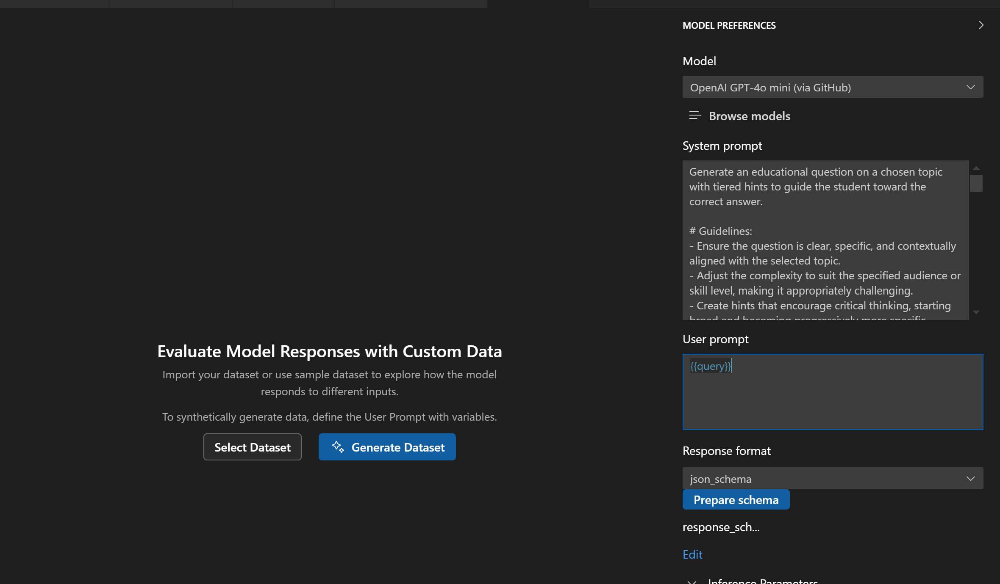
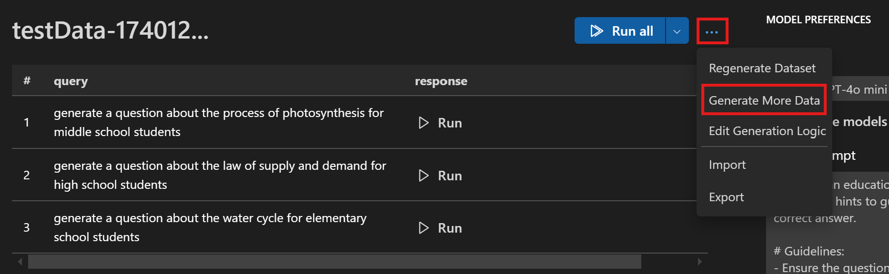
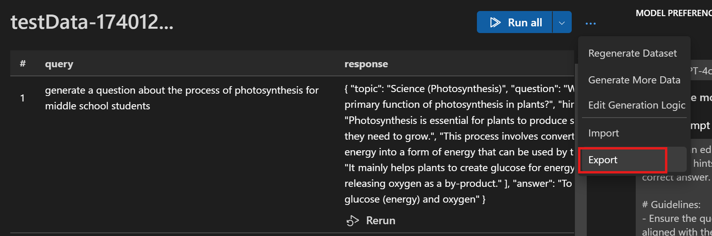
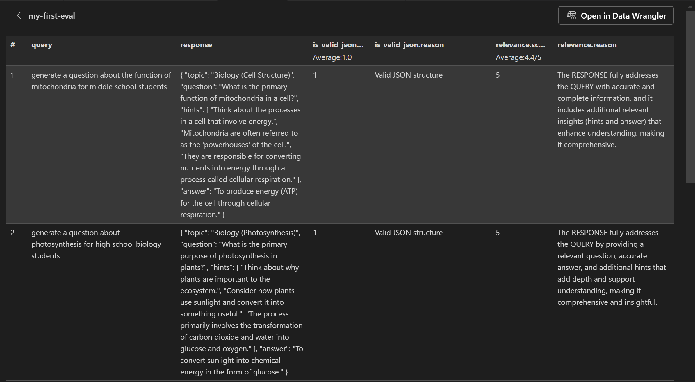

# Educational Question Generator Sample App
This app generates educational questions based on a topic or subject area provided by the user. It interacts with an AI model through the Azure AI Inference SDK.

## What You Will Learn
- Generate test datasets
- Perform bulk runs on datasets
- Export data (input & output) for evaluation
- Create and run evaluations
- Add a code-based (Python) evaluator

## Prerequisites
- Python installed on your system
- Access to GitHub models
- GitHub Personal Access Token (PAT)

## Run the App Locally
1. Install the required package:

    ```bash
    pip install azure-ai-inference
    ```

2. Set up model authentication:
    - Generate a GitHub Personal Access Token (PAT) at https://github.com/settings/tokens
    - Set your token as an environment variable `GITHUB_TOKEN`

3. Navigate to the project directory and run the Python script:
    ```bash
    python app.py
    ```

4. Using the chat:
    - Enter your message at the prompt
    - Wait for the AI response
    - Type `exit` to quit

## Generate Dataset
1. In the AI Toolkit view, select **TOOLS** > **Bulk Run** to open the Bulk Run view.
2. Configure the prompt:
    1. Copy and paste the system prompt from `prompt.txt`.
    2. Input `{{query}}` in the user prompt input box.
    3. In `Response Format`, select `json_schema`, then click the `Prepare schema` button, select `Use local file`, and choose the `response_schema.json` file as the JSON schema file.
3. Click `Generate Dataset` to generate the initial dataset.

4. You can also click the `Generate More Data` button to add more test data.


## Bulk Run
1. Click the `Run all` button to get responses for the entire input dataset.
2. Click the `...` icon and select `Export` to save the results to a JSONL file. This file will then be used to perform evaluation.


## Add a Code-based Evaluator

Evaluation criteria we want to add for this user scenario:
- **is_valid_json** (code-based evaluator): Ensure that the output generated by the AI model adheres to the expected JSON schema. This includes checking for the presence of required fields and the correct data types.
- **Relevance** (built-in LLM-as-a-judge evaluator): Assess the relevance of the generated questions to the provided topic. This involves evaluating whether the questions are meaningful and appropriate for the given subject area.

To add a code-based evaluator, follow these steps:
1. In the AI Toolkit view, select **TOOLS** > **Evaluation**.
2. Click the `Evaluators` tab, then click `Create Evaluator`.
3. Configure the `is_valid_json` evaluator as shown below:

4. Click `Generate Evaluator Code` to open the evaluator code file in VS Code. Copy the code sample from [is_valid_json_evaluator.py](./is_valid_json_evaluator.py) and save the code.

## Create and Run Evaluation

1. In the **Evaluation** overview page:
2. Select `Create Evaluation`, and then provide the following information:
    - Evaluation job name: default or a name you specify
    - Evaluator: select the `is_valid_json` and `Relevance` evaluator.
    - Judging model: a model from the list that can be selected as judging model to evaluate for some evaluators.
    - Dataset: select the JSON file you exported from the previors bulk runs
3. A new evaluation job is created and you will be prompted to open your new evaluation job details.
4. Verify your dataset and select `Run Evaluation` to start the evaluation.
5. Once the evaliation job completed, you can check the result in the `Evaluation` view:


