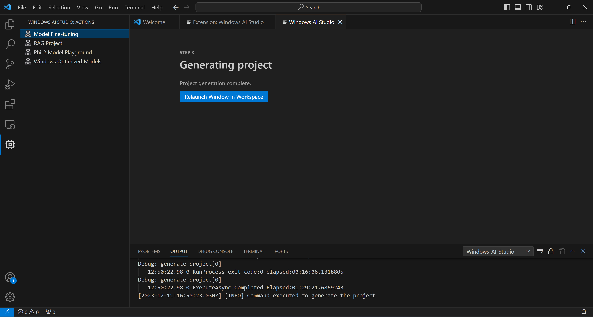
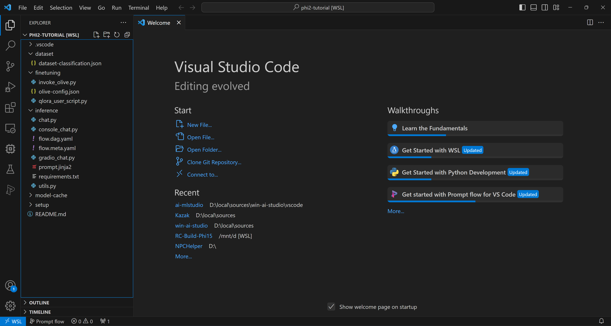
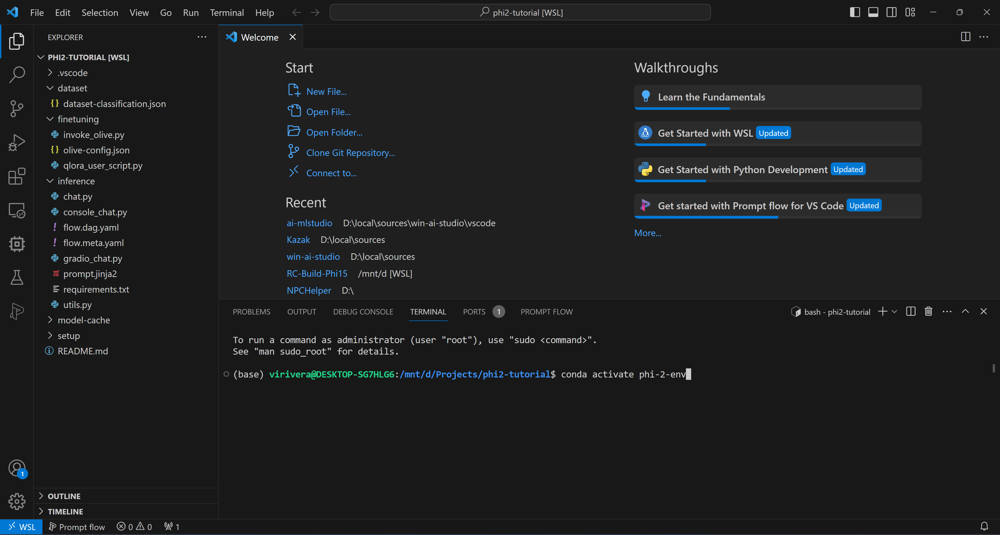
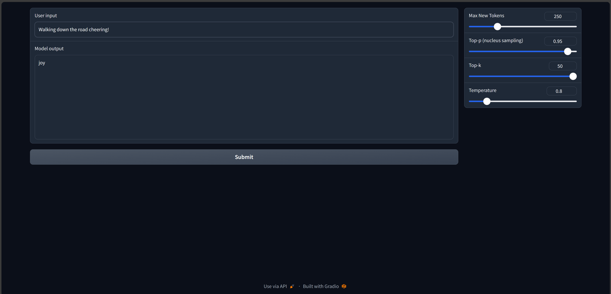

# Streamlined Model Fine-Tuning with Windows AI Studio in VSCode

Welcome to a simplified journey of model fine-tuning using the Windows AI Studio extension in VSCode. This guide is tailored for both beginners and those seeking a quick setup. By using default settings, we will fine-tune a model to classify text into emotions such as joy, sadness, and fear.

## Installing the Extension
Firstly, to install the Windows AI Studio extension, search for `Windows AI Studio` in the VSCode extension marketplace or execute `code --install-extension ms-windows-ai-studio.windows-ai-studio` in the console. Follow the VSCode instructions to reload the window after installation.

## Launching the Extension
Once installed, the extension is accessible from the left menu in VSCode or under the extended menu marked with `...`.

## Requirements Validation
The extension ensures your machine is ready by checking for essential requirements like NVIDIA Drivers (ensure you have the latest version) and WSL installation. The extension conveniently handles additional requirements.

If you need to install something you will see a page like this to start the process or ask you to install what is needed. 

## Initiating Model Fine-Tuning
Navigate to `Model Fine-tuning` to view the model catalog, sourced from Azure Model Catalog or Hugging Face.

> IMPORTANT  
> Models from Hugging Face may require acceptance of license terms.

Name your project and choose its location on your machine. For this tutorial, select the `Phi-2` model and proceed to `Configure Project`. This action sets up the project template without downloading the model.

## Configuring the Project
The Olive configuration settings will appear with default values. We'll use the provided toy-dataset for this tutorial. Familiarize yourself with the settings using tooltips, then proceed to `Generate Project`. This stage leverages WSL and involves setting up a new Conda environment, preparing for future updates that include Dev Containers.

## Project Generation and Configuration Steps:
1. Configuring the project with the selected settings.
2. Downloading the chosen model.
3. Setting up the Conda environment.

## Starting to Use the Project
After project generation, use the `Relaunch Window in Workspace` option. This opens a new WSL remote and the generated project.

Explore the project structure, including folders like 'finetuning', 'dataset', 'inference', and 'setup'. 

Start a terminal in VSCode, which opens with a base Conda shell. Activate the environment (default name: `phi-2-env`) with `conda activate phi-2-env`.

> IMPORTANT
> If there's an issue, initialize the environment manually using `bash /mnt/[PROJECT_PATH]/setup/first_time_setup.sh`

## Beginning the Fine-Tuning Process
Finally, start fine-tuning with `python finetuning/invoke_olive.py`. Monitor the process via terminal outputs.

This process will use QLoRA for fine-tuning and generate LoRA adapters for the model to use while inferencing.

## Inferencing with the fine-tuned model

Now that we have the adapters trained in the workspace we can try some of the test apps. First let's take a look at the console test application. `cd inference` once you are in the inference folder you can run `python console_chat.py` this will load the model and the adapter. 

We also have a simple gradio application available to chat with the model. From the same folder `cd inference` you can run `python gradio_chat.py` this will lauch the Gradio server and you can start the app from the link in the terminal.

Here you can test the model. If you used the simple dataset you can write things like `Walking down the road cheering.`

**Troubleshooting and Further Assistance:**
- If you encounter issues during any step, refer to the VSCode output logs for detailed error messages.
- For further guidance or to provide feedback on this walkthrough, feel free to reach out through our [repo](https://github.com/microsoft/windows-ai-studio/issues) or [Q&A](https://github.com/microsoft/windows-ai-studio/blob/main/QA.md)
